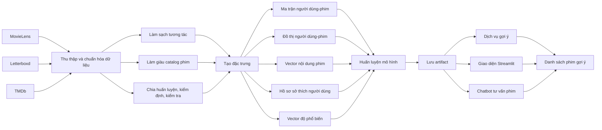
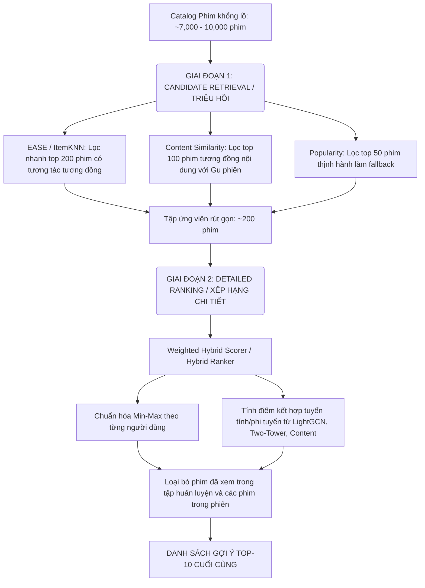

# HỆ THỐNG GỢI Ý PHIM DỰA TRÊN DỮ LIỆU NGƯỜI DÙNG VÀ NỘI DUNG PHIM

# TÓM TẮT ĐỀ TÀI

Sự phát triển của các nền tảng xem phim trực tuyến, cơ sở dữ liệu phim và cộng đồng đánh giá phim khiến người dùng có thể tiếp cận một lượng nội dung rất lớn. Tuy nhiên, khi số lượng phim tăng lên, người dùng thường gặp tình trạng quá tải lựa chọn: họ khó xác định bộ phim nào phù hợp với sở thích cá nhân, thời điểm xem hiện tại và bối cảnh sử dụng cụ thể. Hệ thống gợi ý phim được xây dựng nhằm giải quyết vấn đề này bằng cách phân tích lịch sử tương tác của người dùng, đặc điểm nội dung của phim và các tín hiệu bổ trợ như độ phổ biến, điểm đánh giá cộng đồng, thể loại, đạo diễn, diễn viên và mô tả nội dung.

Đề tài xây dựng một hệ thống gợi ý phim theo hướng lai, kết hợp dữ liệu hành vi người dùng với siêu dữ liệu phim. Dữ liệu hành vi được khai thác từ MovieLens và bộ dữ liệu Letterboxd do nhóm thu thập. Siêu dữ liệu phim được làm giàu từ TMDb, bao gồm mô tả nội dung, poster, thể loại mở rộng, từ khóa, đạo diễn, biên kịch, diễn viên, năm phát hành, thời lượng, điểm đánh giá cộng đồng và độ phổ biến. Sau khi làm sạch dữ liệu, hệ thống chuyển bài toán từ dự đoán điểm đánh giá sang bài toán xếp hạng danh sách phim dựa trên phản hồi tích cực. Một tương tác được xem là tích cực khi người dùng đánh giá phim từ 4.0 trên thang 5.0 trở lên.

Về phương pháp, đề tài triển khai nhiều nhóm mô hình gợi ý: mô hình dựa trên độ phổ biến, mô hình láng giềng dựa trên độ tương tự người dùng hoặc phim, phân rã ma trận, mô hình tối ưu xếp hạng theo cặp, EASE, LightGCN, gợi ý dựa trên nội dung, mô hình hai tháp và mô hình lai. Trong đó, hệ thống demo chính sử dụng artifact đã huấn luyện sẵn, kết hợp điểm từ LightGCN, mô hình hai tháp, độ tương tự nội dung và độ phổ biến. Ngoài gợi ý theo lịch sử dài hạn, hệ thống còn hỗ trợ gợi ý theo gu phiên hiện tại: người dùng có thể chọn một vài phim đang quan tâm trong phiên sử dụng, sau đó hệ thống điều chỉnh danh sách gợi ý theo các phim vừa chọn. Cơ chế này giúp hệ thống phù hợp hơn với người dùng mới, người dùng chưa chọn tài khoản hoặc người dùng có nhu cầu xem phim ngắn hạn khác với lịch sử trước đó.

Về thực nghiệm, hệ thống được đánh giá trên hai tập dữ liệu MovieLens và Letterboxd bằng các thước đo xếp hạng trong 10 gợi ý đầu, gồm Precision@10, Recall@10, NDCG@10 và MRR. Kết quả cho thấy EASE là mô hình mạnh nhất nếu xét chất lượng tổng thể trên cả hai tập dữ liệu. Tuy nhiên, các mô hình lai có ý nghĩa thực tiễn cao hơn trong những trường hợp người dùng có ít lịch sử, phim thuộc nhóm ít tương tác hoặc phiên sử dụng cần điều chỉnh theo sở thích tạm thời. Trên MovieLens, EASE đạt NDCG@10 bằng 0.0506, trong khi mô hình lai học xếp hạng đạt NDCG@10 bằng 0.0437 và đạt kết quả tốt nhất ở nhóm người dùng ít dữ liệu. Trên Letterboxd, EASE đạt NDCG@10 bằng 0.1376, còn mô hình lai học xếp hạng đạt 0.1219 và vượt EASE rõ rệt ở nhóm người dùng thưa dữ liệu. Điều này cho thấy không có một mô hình duy nhất tốt nhất cho mọi bối cảnh; lựa chọn mô hình cần phụ thuộc vào mục tiêu sử dụng, độ dày dữ liệu, yêu cầu giải thích và khả năng xử lý cold-start.

Ngoài phần huấn luyện và đánh giá mô hình, đề tài xây dựng một hệ thống demo gồm dịch vụ gợi ý bằng FastAPI, giao diện người dùng bằng Streamlit, dashboard phân tích dữ liệu và chatbot tư vấn phim bằng tiếng Việt. Hệ thống có thể tìm kiếm phim, xem chi tiết phim, xem phim tương tự, nhận gợi ý cá nhân hóa, thêm phim vào gu phiên hiện tại, lưu đánh giá mới vào kho dữ liệu phụ và trả lời câu hỏi tự nhiên về phim dựa trên catalog đã làm giàu.

# DANH MỤC THUẬT NGỮ

| Thuật ngữ | Ý nghĩa trong báo cáo |
| --- | --- |
| Người dùng | Cá nhân có lịch sử đánh giá hoặc tương tác với phim |
| Phim | Đối tượng được gợi ý trong catalog của hệ thống |
| Tương tác | Một dòng dữ liệu thể hiện người dùng đã đánh giá hoặc quan tâm đến phim |
| Tương tác tích cực | Tương tác có điểm đánh giá từ 4.0/5.0 trở lên |
| Siêu dữ liệu phim | Thông tin mô tả phim như thể loại, mô tả, đạo diễn, diễn viên, từ khóa, poster, năm phát hành |
| Phản hồi ngầm | Cách biểu diễn chỉ quan tâm việc người dùng có tương tác tích cực hay không, thay vì dự đoán chính xác điểm đánh giá |
| Gợi ý theo phiên | Gợi ý dựa trên các phim người dùng vừa chọn trong phiên sử dụng hiện tại |
| Cold-start | Tình huống người dùng hoặc phim có quá ít dữ liệu tương tác |
| Long-tail | Nhóm phim ít được tương tác, thường khó được gợi ý bởi mô hình cộng tác thuần |
| Artifact | Tập kết quả sau huấn luyện được lưu lại để phục vụ suy luận, ví dụ embedding, trọng số mô hình, catalog và metric |

# CHƯƠNG 1. GIỚI THIỆU

## 1.1. Bối cảnh

Trong những năm gần đây, các nền tảng xem phim trực tuyến và cộng đồng đánh giá phim như Netflix, Disney+, HBO Max, IMDb, Letterboxd hay các dịch vụ xem phim theo yêu cầu phát triển mạnh mẽ. Người dùng có thể tiếp cận một số lượng phim rất lớn, thuộc nhiều thể loại, quốc gia, thời kỳ phát hành và phong cách khác nhau. Sự phong phú này giúp người dùng có nhiều lựa chọn hơn, nhưng đồng thời cũng tạo ra vấn đề quá tải thông tin: người dùng khó tìm được những bộ phim thật sự phù hợp với sở thích cá nhân nếu chỉ duyệt thủ công.

Hệ thống gợi ý phim được xây dựng để giải quyết vấn đề trên. Thay vì yêu cầu người dùng tự tìm kiếm trong hàng nghìn bộ phim, hệ thống phân tích lịch sử đánh giá, tương tác và thông tin nội dung phim để tạo danh sách phim có khả năng phù hợp nhất với từng người dùng. Trong miền phim ảnh, hai nhóm thông tin đặc biệt quan trọng là:

- Dữ liệu hành vi người dùng, ví dụ người dùng từng đánh giá cao hoặc tương tác tích cực với phim nào.
- Siêu dữ liệu phim, ví dụ thể loại, mô tả nội dung, từ khóa, đạo diễn, diễn viên, năm phát hành, độ phổ biến và hình ảnh poster.

Tuy nhiên, chỉ sử dụng một loại tín hiệu thường không đủ. Các phương pháp học từ hành vi người dùng có thể cá nhân hóa tốt khi người dùng có nhiều lịch sử, nhưng gặp khó khăn với người dùng mới, người dùng có ít tương tác hoặc các phim ít người đánh giá. Ngược lại, các phương pháp dựa trên nội dung có thể khai thác siêu dữ liệu để hiểu đặc điểm của phim, nhưng nếu sử dụng đơn lẻ thì thường chưa phản ánh đầy đủ khẩu vị cá nhân của từng người. Vì vậy, đồ án xây dựng một hệ thống gợi ý phim kết hợp nhiều nguồn tín hiệu, gồm lịch sử tương tác, nội dung phim, độ phổ biến và ngữ cảnh phiên sử dụng hiện tại.

Điểm mở rộng quan trọng của hệ thống là khả năng gợi ý theo “gu phiên hiện tại”. Người dùng có thể chọn một vài phim đang quan tâm trong phiên sử dụng, sau đó hệ thống điều chỉnh danh sách gợi ý theo các phim vừa chọn. Cách tiếp cận này giúp hệ thống hoạt động tốt hơn trong trường hợp người dùng mới, người dùng chưa chọn tài khoản, hoặc khi sở thích ngắn hạn của người dùng khác với lịch sử dài hạn.

## 1.2. Bài toán

Đề tài tập trung vào bài toán gợi ý phim cá nhân hóa. Với một người dùng hoặc một phiên sử dụng hiện tại, hệ thống cần xếp hạng các phim chưa xem và trả về danh sách những phim phù hợp nhất.

### Đầu vào
Dữ liệu đầu vào cung cấp cho hệ thống bao gồm thông tin định danh và lịch sử tương tác chi tiết của người dùng trong hệ thống MovieLens hoặc Letterboxd. Lịch sử tương tác ban đầu chứa các thông tin thô như mã phim, tên phim và thể loại cơ sở, sau đó được tích hợp thêm các trường siêu dữ liệu phong phú từ TMDb bao gồm tóm tắt nội dung, thể loại mở rộng, từ khóa phân loại, danh sách đạo diễn, diễn viên, biên kịch, poster trực quan cùng các thống kê cộng đồng như độ phổ biến, lượt đánh giá và điểm trung bình. Ngoài ra, đầu vào của bài toán gợi ý theo phiên còn tiếp nhận các tùy chọn động từ giao diện tương tác, bao gồm danh sách các phim được chọn trong phiên hiện hành của người dùng, mức ưu tiên cân bằng giữa sở thích ngắn hạn với lịch sử dài hạn, và số lượng gợi ý cần truy xuất ($K$).

### Đầu ra
Kết quả đầu ra của hệ thống là một danh sách $K$ bộ phim được sắp xếp theo điểm dự đoán giảm dần của thuật toán. Danh sách này đi kèm đầy đủ thông tin hiển thị bao gồm định danh hệ thống và định danh TMDb, tên phim, điểm số tương thích đã chuẩn hóa, thể loại, poster, nội dung tóm tắt, đạo diễn và diễn viên chính. Đặc biệt, để gia tăng tính minh bạch và độ tin cậy của hệ thống, mỗi gợi ý được gán kèm các nhãn giải thích lý do cụ thể (như tương thích thể loại trong phiên, cùng đạo diễn với phim đã xem, hoặc sự đóng góp nổi bật từ hành vi cộng tác của cộng đồng).

### Phát biểu bài toán

Cho tập người dùng, tập phim và tập tương tác đã quan sát được, hệ thống cần học cách ước lượng mức độ phù hợp giữa từng người dùng và từng phim chưa xem. Sau đó, hệ thống loại bỏ các phim đã xuất hiện trong lịch sử huấn luyện của người dùng, sắp xếp các phim còn lại theo điểm phù hợp và chọn ra danh sách các phim nên gợi ý.

Trong dự án này, một tương tác được xem là tích cực khi người dùng đánh giá phim từ 4.0 trên thang 5.0 trở lên. Vì vậy, bài toán được tiếp cận theo hướng xếp hạng phim dựa trên phản hồi ngầm: hệ thống tập trung vào việc chọn và sắp xếp những phim nên gợi ý trước, thay vị chỉ dự đoán chính xác điểm đánh giá tuyệt đối.

## 1.3. Kịch bản ứng dụng

Hệ thống hỗ trợ ba kịch bản sử dụng chính.

### Kịch bản 1: Người dùng đã có lịch sử đánh giá

Người dùng đã có lịch sử tương tác trong MovieLens hoặc Letterboxd. Khi người dùng truy cập hệ thống và chọn tài khoản, hệ thống truy xuất các phim mà người dùng từng đánh giá tích cực. Từ lịch sử này, hệ thống kết hợp nhiều nguồn thông tin như mối quan hệ cộng tác giữa người dùng và phim trong ma trận tương tác, đặc trưng nội dung tĩnh và siêu dữ liệu phim, các vector biểu diễn ẩn (embeddings) được học bởi mô hình sâu, cùng phân phối độ phổ biến của các tác phẩm trong toàn bộ tập dữ liệu. Các nguồn thông tin này được chuẩn hóa và tích hợp thông qua bộ xếp hạng lai để tạo danh sách gợi ý cá nhân hóa tối ưu, giúp học sâu sắc khẩu vị dài hạn của người dùng.

### Kịch bản 2: Người dùng mới hoặc chưa chọn tài khoản

Trong trường hợp người dùng chưa có lịch sử hoặc đang sử dụng hệ thống ở chế độ khách, hệ thống vẫn có thể gợi ý dựa trên các phim người dùng chọn trong phiên hiện tại. Người dùng chỉ cần thêm một vài phim vào “gu phiên hiện tại”, hệ thống sẽ tạo hồ sơ sở thích tạm thời từ nội dung của các phim đó và tìm các phim tương tự trong catalog.

Kịch bản này giúp giải quyết vấn đề khởi đầu lạnh cho người dùng mới. Thay vì yêu cầu người dùng phải đánh giá nhiều phim trước khi nhận được gợi ý, hệ thống có thể phản hồi ngay dựa trên một vài lựa chọn ban đầu.

### Kịch bản 3: Người dùng muốn điều chỉnh gu xem phim trong phiên hiện tại

Ngay cả khi người dùng đã có lịch sử dài hạn, sở thích trong một phiên xem cụ thể có thể thay đổi. Ví dụ, một người thường xem phim hành động nhưng hôm nay muốn tìm phim lãng mạn hoặc phim tâm lý nhẹ nhàng. Vì vậy, hệ thống cho phép người dùng thêm hoặc bỏ phim khỏi “gu phiên hiện tại” và điều chỉnh mức ưu tiên của gu phiên so với lịch sử cá nhân.

Khi mức ưu tiên gu phiên cao, hệ thống sẽ tập trung hơn vào các phim giống với những phim vừa được chọn. Khi mức ưu tiên thấp, hệ thống sẽ dựa nhiều hơn vào lịch sử dài hạn của người dùng. Cơ chế này giúp trải nghiệm gợi ý linh hoạt hơn, phù hợp với nhu cầu tức thời thay vì chỉ phản ánh thói quen trong quá khứ.

### Kịch bản 4: Hỏi đáp bằng ngôn ngữ tự nhiên

Ngoài gợi ý theo người dùng và theo phiên, hệ thống còn có chatbot tư vấn phim. Người dùng có thể nhập các yêu cầu như muốn xem phim khoa học viễn tưởng về không gian, phim giống một tác phẩm cụ thể, hoặc phim tâm lý có nội dung cảm động. Chatbot truy xuất các phim liên quan từ catalog dựa trên siêu dữ liệu và trả lời bằng tiếng Việt.

Kịch bản này giúp người dùng tìm phim theo nhu cầu tự nhiên hơn, đặc biệt khi người dùng không biết chính xác tên phim hoặc không muốn thao tác qua nhiều bộ lọc.

## 1.4. Mục tiêu

Mục tiêu cốt lõi của đề tài là nghiên cứu, xây dựng và đánh giá một hệ thống gợi ý phim lai tối ưu, có khả năng cá nhân hóa danh sách gợi ý dựa trên sự kết hợp giữa hành vi người dùng và đặc trưng nội dung, đồng thời triển khai thành công một sản phẩm demo tương tác hoàn chỉnh.

Để đạt được mục tiêu tổng quát đó, đề tài tập trung giải quyết ba nhóm nhiệm vụ cụ thể. Trước hết, về mặt dữ liệu, đề tài hướng tới việc thiết lập quy trình chuẩn hóa và làm sạch dữ liệu tương tác từ hai nguồn MovieLens và Letterboxd về một cấu trúc thống nhất; chuyển đổi dữ liệu phản hồi tường minh thành phản hồi ngầm thông qua ngưỡng đánh giá tích cực (rating $\geq 4.0$); đồng thời làm giàu catalog phim bằng các thuộc tính siêu dữ liệu phong phú thu thập từ TMDb. Trên cơ sở đó, dữ liệu được biểu diễn dưới dạng ma trận tương tác, đồ thị liên kết hai phía và không gian vector nội dung để sẵn sàng làm đầu vào cho các thuật toán.

Nhiệm vụ tiếp theo liên quan đến xây dựng mô hình gợi ý. Đề tài triển khai và tối ưu hóa một hệ thống mô hình đa dạng: từ các mô hình nền tảng tuyến tính (Popularity, ItemKNN, UserKNN, SVD, EASE) đến các mô hình học máy và học biểu diễn hiện đại (LightGCN trên đồ thị, Two-Tower MLP). Trên nền tảng các mô hình thành phần, đề tài nghiên cứu phương thức lai ghép thông qua bộ xếp hạng học tập (Hybrid Ranker) hoặc kết hợp trọng số để tích hợp đa dạng tín hiệu từ cộng tác, nội dung, biểu diễn ẩn và độ phổ biến của phim. Hơn nữa, hệ thống được trang bị cơ chế gợi ý theo gu phiên hiện tại nhằm giải quyết vấn đề khởi đầu lạnh cho người dùng mới và đáp ứng nhu cầu thay đổi sở thích ngắn hạn.

Cuối cùng, về mặt đánh giá và triển khai, đề tài thực hiện quy trình kiểm thử mô hình nghiêm ngặt bằng các chỉ số xếp hạng danh sách (Precision@k, Recall@k, NDCG@k, MRR) trên cả hai tập dữ liệu MovieLens và Letterboxd, chú trọng phân tích hiệu năng trên lát cắt người dùng thưa và phim đuôi dài. Toàn bộ các kết quả nghiên cứu được đóng gói thành các mô hình suy luận ổn định (artifacts), phục vụ trực tiếp cho hệ thống ứng dụng thực tế gồm backend dịch vụ FastAPI, giao diện Streamlit trực quan, bảng điều khiển phân tích EDA và chatbot tư vấn tiếng Việt hỗ trợ RAG.

## 1.5. Phạm vi nghiên cứu

Trong khuôn khổ đồ án, phạm vi nghiên cứu được xác định rõ ràng trên bốn khía cạnh cốt lõi bao gồm dữ liệu, bài toán, phương pháp và kiến trúc hệ thống triển khai.

**Về khía cạnh dữ liệu:** Nghiên cứu sử dụng tập dữ liệu MovieLens làm tập chuẩn để huấn luyện, căn chỉnh và đánh giá mô hình. Đồng thời, bộ dữ liệu Letterboxd do nhóm tự thu thập được sử dụng để kiểm thử khả năng tổng quát hóa của thuật toán trong môi trường thực tế thưa thớt hơn. Catalog phim được làm giàu thông tin thông qua TMDb API. Quá trình chia tập dữ liệu trên Letterboxd sử dụng phương pháp phân chia ngẫu nhiên ổn định theo từng người dùng do hạn chế về độ tin cậy của dấu thời gian thu thập dữ liệu hành vi. Các thông tin nhạy cảm của người dùng nằm ngoài phạm vi khai thác của đề tài.

**Về khía cạnh bài toán:** Đề tài tập trung giải quyết bài toán gợi ý danh sách phim cá nhân hóa (Top-K recommendation) dựa trên phản hồi ngầm, tối ưu hóa thứ tự ưu tiên của các phim trong danh sách thay vì đi sâu vào bài toán hồi quy dự đoán điểm số đánh giá tuyệt đối. Cơ chế gợi ý theo phiên ngắn hạn được tích hợp để điều phối danh sách gợi ý dựa trên hành vi tương tác tạm thời của người dùng. Các bài toán ngoài lề như dự báo doanh thu phòng vé, phân tích cảm xúc văn bản đánh giá, nhận diện poster phim hay dự báo xu hướng thị trường đều không thuộc phạm vi nghiên cứu.

**Về khía cạnh phương pháp:** Đề tài giới hạn việc nghiên cứu và cài đặt các nhóm thuật toán bao gồm gợi ý dựa trên độ phổ biến, lọc cộng tác cổ điển (KNN, SVD), mô hình tự mã hóa tuyến tính (EASE), học biểu diễn đồ thị tương tác (LightGCN), gợi ý dựa trên nội dung tĩnh (TF-IDF), mạng nơ-ron hai tháp (Two-Tower MLP), và các bộ xếp hạng lai ghép (Weighted Hybrid, Learned Hybrid Ranker). Chatbot hỗ trợ được xây dựng trên cơ chế tìm kiếm tương đồng ngữ nghĩa kết hợp mô hình ngôn ngữ lớn (RAG).

**Về khía cạnh hệ thống:** Hệ thống được phát triển với mục đích học tập, nghiên cứu khoa học và trình diễn công nghệ (demo). Quá trình suy luận gợi ý thời gian thực và chatbot phản hồi dựa hoàn toàn trên việc tải các artifacts đã được huấn luyện offline trước đó, không thực hiện cập nhật trọng số mô hình hoặc huấn luyện lại trực tuyến khi có yêu cầu từ client. Giao diện demo hỗ trợ đầy đủ các thao tác tìm kiếm, xem chi tiết, xem phim tương tự, thiết lập gu phiên và điều chỉnh mức ưu tiên gợi ý. Hệ thống không hướng tới triển khai thương mại quy mô lớn, chịu tải cao hoặc xử lý dữ liệu luồng trực tuyến.

## 1.6. Đóng góp của đề tài

Đề tài mang lại những đóng góp cụ thể về dữ liệu, phương pháp nghiên cứu, đánh giá thực nghiệm và triển khai ứng dụng thực tế.

**Về mặt dữ liệu:** Đề tài đã xây dựng thành công một quy trình thống nhất giúp chuẩn hóa và làm sạch hai nguồn dữ liệu có cấu trúc khác biệt là MovieLens và Letterboxd về cùng một schema phục vụ huấn luyện mô hình. Đồng thời, catalog phim đã được làm giàu thông tin chiều sâu từ TMDb bao gồm tóm tắt, từ khóa, đoàn làm phim và các thuộc tính thống kê cộng đồng, cung cấp một nguồn tri thức hoàn chỉnh cho cả thuật toán gợi ý và chatbot tương tác.

**Về mặt phương pháp:** Nghiên cứu đã triển khai và thực hiện so sánh đối chứng một hệ thống thuật toán đa dạng trên cùng một quy trình đánh giá chuẩn. Đề tài đề xuất phương pháp xếp hạng lai kết hợp tối ưu giữa hành vi cộng tác, đặc trưng nội dung tĩnh, biểu diễn nhúng ẩn và độ phổ biến toàn cục. Hơn nữa, việc tích hợp cơ chế gu phiên động cho phép người dùng kiểm soát sự cân bằng sở thích ngắn hạn và lịch sử dài hạn, mở ra hướng giải quyết tự nhiên cho bài toán khởi đầu lạnh. Việc thực hiện ablation study định lượng rõ ràng đóng góp của siêu dữ liệu TMDb trong bối cảnh thưa thớt dữ liệu khác nhau.

**Về mặt thực nghiệm:** Đề tài cung cấp các kết quả đánh giá thực chứng chi tiết trên cả hai tập dữ liệu MovieLens và Letterboxd thông qua các thước đo Top-10 định hướng xếp hạng danh sách. Phân tích thực nghiệm được bóc tách sâu sắc theo các lát cắt đối tượng khác nhau như người dùng thưa lịch sử (sparse users) và phim đuôi dài (long-tail items), làm nổi bật sự đánh đổi thực tiễn giữa độ chính xác toàn cục và độ đa dạng phân phối gợi ý.

**Về mặt triển khai hệ thống:** Đề tài hoàn thiện một hệ thống demo đầu-cuối từ pipeline dữ liệu offline đến phục vụ online. Hệ thống bao gồm backend API tốc độ cao bằng FastAPI, giao diện tương tác Streamlit mô phỏng ứng dụng xem phim thực tế, dashboard trực quan hóa dữ liệu EDA và không gian nhúng phim, cùng chatbot tư vấn phim tiếng Việt ứng dụng kỹ thuật RAG.

## 1.7. Cấu trúc báo cáo

Báo cáo đồ án môn học được tổ chức thành tám chương nội dung chính. Chương 1 giới thiệu bối cảnh, bài toán, mục tiêu, phạm vi nghiên cứu và đóng góp khoa học của đề tài. Chương 2 tập trung vào cơ sở lý thuyết, làm rõ các phương pháp lọc cộng tác, gợi ý dựa trên nội dung, học biểu diễn đồ thị GNN và các mô hình học xếp hạng lai ghép. Chương 3 mô tả chi tiết nguồn dữ liệu, quy trình làm sạch, làm giàu catalog và phân tích khám phá dữ liệu (EDA). Chương 4 trình bày phương pháp đề xuất, chi tiết kiến trúc hệ thống và quy trình triển khai thuật toán. Chương 5 tổng hợp kết quả đánh giá thực nghiệm định lượng và phân tích định tính trên hai tập dữ liệu. Chương 6 mô tả chi tiết quá trình xây dựng và vận hành hệ thống demo tương tác, backend API và chatbot tư vấn. Chương 7 phân tích các khó khăn, hạn chế kỹ thuật và đề xuất các biện pháp giảm thiểu đã áp dụng. Cuối cùng, Chương 8 tổng kết các kết quả đạt được và định hướng các nghiên cứu phát triển tiếp theo của đề tài.

# CHƯƠNG 2. CƠ SỞ LÝ THUYẾT

## 2.1. Tổng quan hệ thống gợi ý

Hệ thống gợi ý là hệ thống hỗ trợ người dùng lựa chọn đối tượng phù hợp trong một tập đối tượng lớn. Trong miền phim ảnh, đối tượng cần gợi ý là phim, còn người dùng được mô tả thông qua lịch sử xem, đánh giá, tìm kiếm hoặc các tương tác khác. Nhiệm vụ của hệ thống là ước lượng mức độ phù hợp giữa người dùng và từng phim, sau đó sắp xếp các phim theo điểm phù hợp để tạo danh sách gợi ý.

Các hệ thống gợi ý thường được chia thành ba nhóm chính. Nhóm thứ nhất là gợi ý cộng tác, khai thác mối quan hệ giữa người dùng và phim. Nhóm thứ hai là gợi ý dựa trên nội dung, khai thác đặc điểm của phim và hồ sơ sở thích của người dùng. Nhóm thứ ba là gợi ý lai, kết hợp nhiều nguồn tín hiệu để tận dụng ưu điểm và giảm hạn chế của từng nhóm riêng lẻ.

Trong bối cảnh đề tài, hệ thống gợi ý không chỉ cần đạt chất lượng xếp hạng tốt mà còn cần phục vụ được demo thực tế. Vì vậy, ngoài độ chính xác, các yếu tố như khả năng giải thích, khả năng xử lý người dùng mới, tốc độ suy luận và khả năng tích hợp giao diện cũng rất quan trọng.

## 2.2. Phản hồi tường minh và phản hồi ngầm

Dữ liệu gợi ý có thể gồm phản hồi tường minh và phản hồi ngầm. Phản hồi tường minh là dữ liệu trong đó người dùng trực tiếp thể hiện mức độ yêu thích, ví dụ điểm đánh giá từ 0.5 đến 5.0. Phản hồi ngầm là dữ liệu chỉ cho biết người dùng đã tương tác hoặc chưa tương tác với đối tượng, ví dụ đã xem, đã nhấn, đã thêm vào danh sách hoặc đã đánh giá tích cực.

MovieLens và Letterboxd đều có điểm đánh giá. Tuy nhiên, thay vì dự đoán chính xác điểm số, đề tài chuyển bài toán sang phản hồi ngầm bằng cách xem các đánh giá từ 4.0 trở lên là tương tác tích cực. Cách tiếp cận này phù hợp với mục tiêu gợi ý danh sách, vì trong thực tế người dùng quan tâm hệ thống đưa phim nào lên đầu hơn là hệ thống dự đoán chính xác họ sẽ chấm phim đó bao nhiêu điểm.

Khi dùng phản hồi ngầm, các phim chưa được người dùng tương tác không thể xem là phim người dùng không thích. Chúng chỉ là các phim chưa quan sát được phản hồi tích cực. Vì vậy, quá trình huấn luyện thường dùng lấy mẫu âm từ các phim chưa quan sát, còn quá trình đánh giá dùng các phim tích cực trong tập kiểm tra làm ground truth.

## 2.3. Bài toán xếp hạng danh sách phim

Trong bài toán xếp hạng, hệ thống cần đưa các phim phù hợp lên vị trí cao trong danh sách. Với mỗi người dùng, mô hình sinh điểm cho toàn bộ phim ứng viên, loại bỏ các phim đã có trong lịch sử huấn luyện, sau đó chọn ra 10 phim có điểm cao nhất để đánh giá. Đây là cách đánh giá gần với kịch bản sử dụng thực tế: người dùng thường chỉ nhìn một số ít gợi ý đầu tiên.

Khác với bài toán hồi quy điểm đánh giá, bài toán xếp hạng không yêu cầu dự đoán chính xác điểm tuyệt đối. Nếu hai phim đều có khả năng phù hợp, điều quan trọng là phim phù hợp hơn phải được xếp trên. Vì vậy, các hàm mất mát theo cặp như BPR và các thước đo như NDCG phù hợp hơn RMSE trong ngữ cảnh này.

## 2.4. Gợi ý dựa trên độ phổ biến

Gợi ý dựa trên độ phổ biến (Popularity-based Recommendation) là phương pháp baseline đơn giản nhưng cực kỳ ổn định. Ý tưởng cốt lõi là các bộ phim được nhiều người dùng tương tác tích cực trong quá khứ sẽ có xác suất cao tiếp tục được yêu thích bởi người dùng mới. 

Trong hệ thống, điểm độ phổ biến $s_{\text{pop}}(i)$ của phim $i$ được tính dựa trên số lượng tương tác tích cực (rating $\geq 4.0$) của phim đó trong tập huấn luyện, sau đó áp dụng phép biến đổi logarit để giảm thiểu sự chi phối quá mức của các phim bom tấn (head items) và chuẩn hóa về đoạn $[0, 1]$:
$$s_{\text{pop}}(i) = \frac{\ln(1 + C_i) - \min_{j \in \mathcal{I}} \ln(1 + C_j)}{\max_{j \in \mathcal{I}} \ln(1 + C_j) - \min_{j \in \mathcal{I}} \ln(1 + C_j) + \epsilon}$$
Trong đó:
- $C_i$ là số lượng tương tác tích cực của phim $i$ trong tập huấn luyện.
- $\mathcal{I}$ là tập hợp tất cả các phim trong catalog.
- $\epsilon = 10^{-9}$ là một hằng số nhỏ để tránh lỗi chia cho 0.

Ưu điểm của phương pháp này là tốc độ tính toán nhanh, không phụ thuộc vào định danh người dùng và là giải pháp dự phòng lý tưởng cho vấn đề người dùng mới (cold-start user). Tuy nhiên, hạn chế lớn nhất là thiếu tính cá nhân hóa và gây ra hiện tượng thiên lệch phổ biến (popularity bias).

## 2.5. Gợi ý cộng tác dựa trên láng giềng

Gợi ý cộng tác dựa trên láng giềng (Neighborhood-based Collaborative Filtering) khai thác mối quan hệ tương đồng giữa các thực thể thông qua ma trận tương tác. Có hai hướng tiếp cận chính:
- **Lọc cộng tác dựa trên phim (Item-based CF):** Ước lượng mức độ quan tâm của người dùng $u$ đối với phim $i$ bằng cách tính tổng có trọng số độ tương đồng giữa phim $i$ và các phim $j$ trong tập lịch sử thích của người dùng $u$:
  $$\hat{s}(u, i) = \frac{\sum_{j \in \mathcal{I}_u} \text{sim}(i, j) \cdot r_{u, j}}{\sum_{j \in \mathcal{I}_u} |\text{sim}(i, j)|}$$
  Trong đó $\mathcal{I}_u$ là tập các phim người dùng $u$ đã thích, và $\text{sim}(i, j)$ thường được đo bằng độ tương đồng Cosine trên các vector tương tác:
  $$\text{sim}(i, j) = \cos(\mathbf{r}_i, \mathbf{r}_j) = \frac{\mathbf{r}_i \cdot \mathbf{r}_j}{\|\mathbf{r}_i\|_2 \|\mathbf{r}_j\|_2}$$
- **Lọc cộng tác dựa trên người dùng (User-based CF):** Dự đoán dựa trên hành vi của các người dùng có sở thích tương đồng (láng giềng):
  $$\hat{s}(u, i) = \frac{\sum_{v \in \mathcal{U}_i} \text{sim}(u, v) \cdot r_{v, i}}{\sum_{v \in \mathcal{U}_i} |\text{sim}(u, v)|}$$
  Trong đó $\mathcal{U}_i$ là tập các người dùng đã tương tác tích cực với phim $i$.

Phương pháp láng giềng trực quan và dễ giải thích (ví dụ: "Phim được gợi ý vì tương tự với phim A bạn từng xem"). Tuy nhiên, khi ma trận tương tác có độ thưa (sparsity) cao, số lượng người dùng đồng tương tác giữa các phim rất ít, dẫn đến các ước lượng độ tương đồng không còn chính xác.

## 2.6. Phân rã ma trận

Phân rã ma trận (Matrix Factorization - MF) giải quyết vấn đề độ thưa bằng cách chiếu cả người dùng và bộ phim vào một không gian ẩn (latent space) có số chiều thấp $d \ll \min(|\mathcal{U}|, |\mathcal{I}|)$.

Mỗi người dùng $u$ được biểu diễn bằng vector sở thích ẩn $\mathbf{p}_u \in \mathbb{R}^d$, và mỗi phim $i$ được biểu diễn bằng vector đặc trưng ẩn $\mathbf{q}_i \in \mathbb{R}^d$. Điểm phù hợp (preference score) dự đoán giữa người dùng $u$ và phim $i$ được tính bằng tích vô hướng giữa hai vector này:
$$\hat{x}_{ui} = \mathbf{p}_u^T \mathbf{q}_i = \sum_{f=1}^d p_{uf} q_{if}$$

Trong các hệ thống lọc cộng tác truyền thống, các vector ẩn được tối ưu bằng cách cực tiểu hóa sai số bình phương (RMSE) trên các tương tác đã quan sát. Đối với bài toán phản hồi ngầm (implicit feedback) của đồ án, phân rã ma trận đóng vai trò là mô hình sinh đặc trưng ẩn quan trọng và được tối ưu trực tiếp bằng hàm mục tiêu xếp hạng theo cặp BPR.

## 2.7. Hàm mất mát BPR

Bayesian Personalized Ranking (BPR) là một khung học máy tối ưu hóa xếp hạng theo cặp (pairwise ranking) được thiết kế riêng cho phản hồi ngầm. Thay vì coi các phim chưa xem là nhãn âm tuyệt đối (như trong hồi quy), BPR giả định rằng người dùng $u$ sẽ ưu tiên các phim đã có tương tác tích cực ($i \in \mathcal{I}_u^+$) hơn các phim chưa quan sát ($j \in \mathcal{I} \setminus \mathcal{I}_u^+$):
$$i >_u j \quad \forall i \in \mathcal{I}_u^+, j \in \mathcal{I} \setminus \mathcal{I}_u^+$$

Hàm mục tiêu BPR tối đa hóa xác suất hậu nghiệm của các tham số mô hình $\Theta$ thông qua hàm mất mát (BPR Loss):
$$\mathcal{L}_{BPR} = -\sum_{(u, i, j) \in \mathcal{D}_S} \ln \sigma(\hat{x}_{ui} - \hat{x}_{uj}) + \lambda_\Theta \|\Theta\|^2$$
Trong đó:
- $\mathcal{D}_S = \{(u, i, j) \mid i \in \mathcal{I}_u^+ \wedge j \in \mathcal{I} \setminus \mathcal{I}_u^+\}$ là tập hợp các bộ ba huấn luyện (triplets).
- $\sigma(x) = \frac{1}{1 + e^{-x}}$ là hàm sigmoid giúp ánh xạ hiệu số điểm về khoảng xác suất $[0, 1]$.
- $\hat{x}_{ui}$ và $\hat{x}_{uj}$ lần lượt là điểm dự đoán của người dùng $u$ đối với phim dương $i$ và phim âm $j$.
- $\lambda_\Theta$ là hệ số điều chuẩn L2 nhằm tránh hiện tượng quá khớp (overfitting).

## 2.8. EASE

EASE (Embarrassingly Shallow Autoencoders) là một mô hình tuyến tính hiệu quả cho phản hồi ngầm. Mô hình này không sử dụng biểu diễn ẩn (latent factors) mà học trực tiếp một ma trận trọng số chuyển đổi giữa các phim $\mathbf{B} \in \mathbb{R}^{|\mathcal{I}| \times |\mathcal{I}|}$ với ràng buộc nghiêm ngặt là các phần tử trên đường chéo chính phải bằng 0 ($\text{diag}(\mathbf{B}) = 0$) để tránh mô hình học phép đồng nhất (identity mapping).

Trong các mạng tự mã hóa (Autoencoders) tuyến tính truyền thống, nếu không có ràng buộc này, mô hình sẽ học được nghiệm tầm thường là ma trận đơn vị $\mathbf{B} = \mathbf{I}$ (identity mapping), nghĩa là hệ thống chỉ đơn giản dự đoán người dùng thích lại đúng những phim họ đã xem trong quá khứ mà không mở rộng được sở thích mới. Bằng cách áp dụng ràng buộc nghiêm ngặt $\text{diag}(\mathbf{B}) = 0$, EASE buộc hệ thống phải tái cấu trúc tương tác của phim $i$ dựa trên tương tác của các phim khác $j \neq i$. Điều này biến mô hình thành một dạng Autoencoder tuyến tính tự hồi quy (autoregressive linear model), giúp mô hình học được mối tương quan gián tiếp giữa các bộ phim một cách ổn định mà không cần thông qua không gian ẩn (latent space) bị suy hao thông tin.

Hàm mục tiêu tối ưu hóa của EASE được định nghĩa như sau:
$$\min_{\mathbf{B}} \|\mathbf{X} - \mathbf{X}\mathbf{B}\|_F^2 + \lambda \|\mathbf{B}\|_F^2 \quad \text{s.t. } \text{diag}(\mathbf{B}) = 0$$
Trong đó:
- $\mathbf{X} \in \{0, 1\}^{|\mathcal{U}| \times |\mathcal{I}|}$ là ma trận tương tác nhị phân của người dùng và phim.
- $\|\cdot\|_F$ ký hiệu chuẩn Frobenius của ma trận.
- $\lambda$ là siêu tham số điều chuẩn L2.

Nhờ tính chất tuyến tính, bài toán tối ưu trên có nghiệm đóng (closed-form solution) rất đẹp và ổn định:
$$\mathbf{B} = \mathbf{I} - \mathbf{P}^{-1} \text{diag}(\mathbf{P}^{-1})^{-1}$$
Với $\mathbf{P} = \mathbf{X}^T \mathbf{X} + \lambda \mathbf{I}$ là ma trận hiệp phương sai của các tương tác phim đã được điều chuẩn. Điểm gợi ý cho người dùng $u$ được tính bằng: $\hat{\mathbf{x}}_u = \mathbf{x}_u \mathbf{B}$.

## 2.9. LightGCN

LightGCN là mô hình học sâu đồ thị (Graph Neural Network) hiện đại được thiết kế tối giản dành riêng cho hệ thống gợi ý. LightGCN biểu diễn tập dữ liệu tương tác dưới dạng đồ thị hai phía (bipartite graph) $\mathcal{G} = (\mathcal{U} \cup \mathcal{I}, \mathcal{E})$, với các nút là người dùng và phim, các cạnh đại diện cho tương tác tích cực.

Trong các mạng nơ-ron đồ thị (GCN) truyền thống cho xử lý ảnh hoặc văn bản, các phép biến đổi phi tuyến (như kích hoạt ReLU) và ma trận trọng số học được tại mỗi lớp là cần thiết để trích xuất đặc trưng mức cao. Tuy nhiên, đối với hệ thống gợi ý, các nút (người dùng và phim) chỉ được biểu diễn bằng các định danh duy nhất (one-hot IDs) mà không có đặc trưng thô phong phú. Thực nghiệm khoa học đã chứng minh việc xếp chồng các phép biến đổi phi tuyến trên ma trận kề của đồ thị hai phía không giúp cải thiện độ chính xác mà ngược lại còn gây ra hiện tượng quá khớp (overfitting) và làm mịn quá mức (over-smoothing) các embedding ở các lớp sâu. Do đó, LightGCN loại bỏ các phép biến đổi phi tuyến và ma trận trọng số của GCN truyền thống, chỉ giữ lại cơ chế lan truyền embedding tuyến tính qua các lớp (layer-propagation).

Ở lớp $k+1$, biểu diễn của người dùng $u$ và phim $i$ được tính bằng trung bình chuẩn hóa biểu diễn ở lớp $k$ của các nút láng giềng:
$$\mathbf{e}_u^{(k+1)} = \sum_{i \in \mathcal{N}_u} \frac{1}{\sqrt{|\mathcal{N}_u||\mathcal{N}_i|}} \mathbf{e}_i^{(k)}$$
$$\mathbf{e}_i^{(k+1)} = \sum_{u \in \mathcal{N}_i} \frac{1}{\sqrt{|\mathcal{N}_i||\mathcal{N}_u|}} \mathbf{e}_u^{(k)}$$
Trong đó $\mathcal{N}_u$ là tập các phim được liên kết với người dùng $u$, và $\mathcal{N}_i$ là tập các người dùng liên kết với phim $i$.

Sau khi lan truyền qua $K$ lớp, mô hình tổng hợp các embedding thành biểu diễn cuối cùng bằng cách lấy trung bình:
$$\mathbf{e}_u = \sum_{k=0}^K \alpha_k \mathbf{e}_u^{(k)}; \quad \mathbf{e}_i = \sum_{k=0}^K \alpha_k \mathbf{e}_i^{(k)}$$
Thông thường, hệ số $\alpha_k$ được đặt đồng đều bằng $\frac{1}{K+1}$. Điểm tương tác dự đoán được tính bằng tích vô hướng: $\hat{x}_{ui} = \mathbf{e}_u^T \mathbf{e}_i$. Mô hình được huấn luyện bằng hàm mất mát BPR loss để điều chỉnh các embedding ban đầu $\mathbf{e}_u^{(0)}$ và $\mathbf{e}_i^{(0)}$.


## 2.10. Gợi ý dựa trên nội dung

Gợi ý dựa trên nội dung (Content-based Filtering) sử dụng siêu dữ liệu của phim để sinh gợi ý. Mỗi bộ phim $i$ được biểu diễn bằng một tài liệu tổng hợp từ các thuộc tính nội dung và được mã hóa thành một vector đặc trưng phim $\mathbf{c}_i \in \mathbb{R}^{d_c}$ (sử dụng TF-IDF kết hợp giảm chiều hoặc mô hình Sentence-BERT).

Hồ sơ sở thích nội dung của người dùng $u$, ký hiệu là $\mathbf{v}_u \in \mathbb{R}^{d_c}$, được xây dựng bằng cách lấy trung bình cộng các vector đặc trưng của những phim người dùng đã tương tác tích cực trong tập huấn luyện:
$$\mathbf{v}_u = \frac{1}{|\mathcal{I}_u^+|} \sum_{i \in \mathcal{I}_u^+} \mathbf{c}_i$$

Điểm phù hợp nội dung giữa người dùng $u$ và bộ phim ứng viên $i$ được xác định thông qua độ tương đồng Cosine:
$$s_{\text{content}}(u, i) = \cos(\mathbf{v}_u, \mathbf{c}_i) = \frac{\mathbf{v}_u \cdot \mathbf{c}_i}{\|\mathbf{v}_u\|_2 \|\mathbf{c}_i\|_2}$$

Với người dùng mới hoặc trong chế độ gợi ý theo phiên, hồ sơ $\mathbf{v}_u$ được thay thế bằng trung bình vector đặc trưng của các phim được người dùng chọn trong phiên sử dụng hiện tại (session context).

## 2.11. Mô hình hai tháp

Mô hình hai tháp (Two-Tower Architecture) là một kiến trúc học sâu mạnh mẽ giúp đồng bộ hóa thông tin cộng tác và thông tin nội dung vào một không gian biểu diễn chung.
- **Tháp người dùng (User Tower):** Nhận định danh người dùng $u$ và ánh xạ thành một vector nhúng tự do học được $\mathbf{e}_u^{\text{user}} \in \mathbb{R}^d$.
- **Tháp phim (Item Tower):** Nhận vector đặc trưng nội dung $\mathbf{c}_i \in \mathbb{R}^{d_c}$ của phim $i$ và đưa qua một mạng nơ-ron đa tầng (MLP) để trích xuất biểu diễn phi tuyến ẩn $\mathbf{e}_i^{\text{item}} \in \mathbb{R}^d$:
  $$\mathbf{e}_i^{\text{item}} = f_{\text{MLP}}(\mathbf{c}_i) = \text{ReLU}(\mathbf{W}_2(\text{ReLU}(\mathbf{W}_1 \mathbf{c}_i + \mathbf{b}_1)) + \mathbf{b}_2)$$

Điểm phù hợp được tính bằng tích vô hướng giữa biểu diễn của hai tháp:
$$\hat{x}_{ui}^{\text{tower}} = (\mathbf{e}_u^{\text{user}})^T \mathbf{e}_i^{\text{item}}$$

Mô hình được huấn luyện bằng hàm mất mát BPR loss trên các bộ ba tương tác. Kiến trúc này giúp tháp phim học cách biến đổi các vector nội dung tĩnh (SBERT/TF-IDF) sang một không gian động phù hợp với hành vi tương tác thực tế của người dùng.

## 2.12. Mô hình lai

Mô hình lai kết hợp (Hybrid Recommendation) tổng hợp sức mạnh từ nhiều mô hình thành phần độc lập nhằm triệt tiêu các nhược điểm đơn lẻ (như cold-start của CF hay thiếu tính đa dạng của Content-based). 

Để kết hợp các nguồn điểm có thang đo và biên độ phân phối khác nhau, hệ thống thực hiện chuẩn hóa Min-Max theo từng người dùng (per-user normalization) cho mỗi nguồn điểm $s \in \{s_{\text{LightGCN}}, s_{\text{TwoTower}}, s_{\text{Content}}, s_{\text{Popularity}}\}$:
$$s_{\text{norm}}(u, i) = \frac{s(u, i) - \min_{j \in \mathcal{A}_u} s(u, j)}{\max_{j \in \mathcal{A}_u} s(u, j) - \min_{j \in \mathcal{A}_u} s(u, j) + \epsilon}$$
Trong đó $\mathcal{A}_u$ là tập hợp các bộ phim ứng viên (phim chưa xem) đối với người dùng $u$.

Điểm lai cuối cùng của phim $i$ cho người dùng $u$ được tính bằng tổng tuyến tính có trọng số:
$$S_{\text{hybrid}}(u, i) = w_{\text{cf}} \cdot S_{\text{LightGCN}}^{\text{norm}}(u, i) + w_{\text{two\_tower}} \cdot S_{\text{TwoTower}}^{\text{norm}}(u, i) + w_{\text{content}} \cdot S_{\text{Content}}^{\text{norm}}(u, i) + w_{\text{pop}} \cdot S_{\text{Popularity}}^{\text{norm}}(u, i)$$
Các trọng số $w_{\text{cf}}, w_{\text{two\_tower}}, w_{\text{content}}, w_{\text{pop}} \geq 0$ và $\sum w = 1$ được tối ưu hóa thông qua quá trình tìm kiếm lưới (Grid Search) trên tập kiểm định để đạt chỉ số NDCG@10 cao nhất.

## 2.13. Các thước đo đánh giá

Để đánh giá chất lượng của danh sách Top-K phim gợi ý ($\text{rec}_u = [a_1, a_2, \dots, a_K]$) so với tập phim thích thực tế của người dùng trong tập kiểm tra ($\mathcal{T}_u$), đồ án sử dụng 4 thước đo xếp hạng chuẩn mực:
- **Precision@K:** Đo lường tỷ lệ gợi ý chính xác trong danh sách Top-K:
  $$\text{Precision}@K = \frac{1}{K} \sum_{k=1}^K I(a_k \in \mathcal{T}_u)$$
  Trong đó $I(\cdot)$ là hàm chỉ thị, trả về 1 nếu điều kiện đúng và 0 nếu ngược lại.
- **Recall@K:** Đo lường tỷ lệ các bộ phim thích thực tế được hệ thống tìm thấy trong Top-K gợi ý:
  $$\text{Recall}@K = \frac{1}{|\mathcal{T}_u|} \sum_{k=1}^K I(a_k \in \mathcal{T}_u)$$
- **NDCG@K (Normalized Discounted Cumulative Gain):** Đánh giá chất lượng xếp hạng dựa trên vị trí của phim đúng. Các phim đúng xuất hiện ở vị trí càng cao sẽ đóng góp nhiều điểm hơn nhờ cơ chế giảm trừ theo logarit của vị trí gợi ý:
  $$\text{DCG}@K = \sum_{k=1}^K \frac{I(a_k \in \mathcal{T}_u)}{\log_2(k + 1)}$$
  $$\text{NDCG}@K = \frac{\text{DCG}@K}{\text{IDCG}@K}$$
  Trong đó $\text{IDCG}@K$ là DCG lý tưởng (Ideal DCG), đạt được khi tất cả các phim đúng được đưa lên các vị trí đầu tiên của danh sách gợi ý.
- **MRR (Mean Reciprocal Rank):** Đánh giá vị trí xuất hiện của bộ phim đúng đầu tiên trong danh sách gợi ý:
  $$\text{MRR} = \frac{1}{\min_{k \in \{1, \dots, K\}} \{k \mid a_k \in \mathcal{T}_u\}}$$
  Nếu danh sách gợi ý không chứa bất kỳ phim nào trong tập kiểm tra, MRR của người dùng đó bằng 0.

## 2.14. Thách thức của bài toán

Bài toán gợi ý phim trong thực tế phải đối mặt với các thách thức kinh điển của Khoa học dữ liệu:
1. **Độ thưa cực lớn (Extreme Sparsity):** Tỷ lệ các ô có dữ liệu trong ma trận tương tác của MovieLens và Letterboxd đều vượt quá $98\%$. Điều này gây khó khăn cho việc học các mối quan hệ cộng tác tin cậy.
2. **Khởi đầu lạnh (Cold-start):** Người dùng mới hoặc phim mới xuất hiện không có lịch sử tương tác để các thuật toán Collaborative Filtering học tập.
3. **Hiện tượng đuôi dài (Long-tail):** Phần lớn lượng tương tác tập trung vào một số rất ít bộ phim nổi tiếng, khiến các mô hình có xu hướng gợi ý lặp đi lặp lại các phim này, bỏ qua các tác phẩm đặc sắc nhưng ít phổ biến hơn ở phần đuôi.
4. **Thiên lệch phổ biến (Popularity Bias):** Các thuật toán dễ bị đánh lừa bởi số lượng tương tác lớn của các phim head items và bỏ qua các tín hiệu cá nhân hóa tinh tế của người dùng.
5. **Khoảng cách đánh giá Offline-Online:** Đánh giá offline dựa trên dữ liệu tĩnh không phản ánh được sự thay đổi sở thích tức thời của người dùng, tính đa dạng cảm nhận và tính giải thích được của hệ thống trong thực tế.

Để giải quyết các thách thức này, đồ án chọn hướng tiếp cận lai kết hợp thông tin cấu trúc đồ thị tương tác từ LightGCN, thông tin nội dung phong phú từ siêu dữ liệu làm giàu TMDb thông qua mô hình Hai tháp/Content-based, và đề xuất cơ chế cập nhật gu phiên (session-based) tương tác thời gian thực.

# CHƯƠNG 3. DỮ LIỆU VÀ TIỀN XỬ LÝ

## 3.1. Tổng quan nguồn dữ liệu

Dự án sử dụng ba nhóm dữ liệu chính: MovieLens, Letterboxd và TMDb. MovieLens là tập dữ liệu chuẩn cho nghiên cứu hệ thống gợi ý, có cấu trúc ổn định và được dùng để so sánh mô hình. Letterboxd là dữ liệu được thu thập riêng, phản ánh môi trường cộng đồng đánh giá phim thực tế hơn và có số lượng người dùng lớn hơn. TMDb là nguồn siêu dữ liệu được dùng để làm giàu thông tin phim, phục vụ cả mô hình nội dung, giao diện demo và chatbot.

| Nguồn dữ liệu | Vai trò | Nội dung chính |
|---|---|---|
| MovieLens | Tập dữ liệu chuẩn để huấn luyện, đánh giá và so sánh mô hình | Đánh giá người dùng-phim, danh sách phim, ánh xạ sang TMDb |
| Letterboxd | Tập dữ liệu thực tế do nhóm thu thập và chuẩn hóa | Tương tác người dùng-phim, danh sách người dùng, danh sách phim |
| TMDb | Làm giàu nội dung phim | Mô tả, poster, thể loại mở rộng, từ khóa, đạo diễn, diễn viên, điểm cộng đồng, độ phổ biến |

## 3.2. Bộ dữ liệu MovieLens

MovieLens được sử dụng trong phiên bản `ml-latest-small`. Đây là bộ dữ liệu có quy mô vừa, phù hợp để huấn luyện và so sánh nhiều mô hình trong môi trường học tập. Dữ liệu gốc gồm bảng đánh giá, bảng phim và bảng liên kết sang các hệ thống định danh bên ngoài.

| Thuộc tính | Giá trị |
|---|---:|
| Số người dùng gốc | 610 |
| Số phim trong catalog | 9.742 |
| Số phim có ít nhất một tương tác | 9.724 |
| Tổng số tương tác | 100.836 |
| Điểm đánh giá trung bình | 3.5016 |
| Số tương tác tích cực | 48.580 |
| Số người dùng còn lại sau lọc tích cực | 609 |
| Số phim còn lại sau lọc tích cực | 6.298 |

MovieLens có timestamp thật cho từng đánh giá, do đó dữ liệu có thể được chia theo thời gian trong từng người dùng. Cách chia này gần với kịch bản thực tế hơn so với chia ngẫu nhiên hoàn toàn, vì mô hình chỉ được học từ các tương tác xảy ra trước và được kiểm tra trên các tương tác xảy ra sau.

## 3.3. Bộ dữ liệu Letterboxd

Letterboxd là bộ dữ liệu được thu thập bằng crawler theo hướng movie-centric và user-centric. Dữ liệu thô gồm các tương tác, thông tin người dùng, thông tin phim và trạng thái thu thập. Sau đó, dữ liệu được chuyển về cấu trúc tương thích với MovieLens để dùng chung pipeline huấn luyện.

| Thuộc tính | Giá trị |
|---|---:|
| Số người dùng gốc | 9.197 |
| Số phim gốc | 7.848 |
| Tổng số tương tác | 503.761 |
| Điểm đánh giá trung bình | 3.4079 |
| Số tương tác tích cực | 202.354 |
| Số người dùng còn lại sau lọc tích cực | 8.985 |
| Số phim còn lại sau lọc tích cực | 7.211 |

Điểm cần lưu ý là thời điểm trong dữ liệu Letterboxd không phản ánh chính xác thời điểm người dùng xem hoặc đánh giá phim. Một số trường thời gian thể hiện thời điểm crawler ghi nhận dữ liệu. Vì vậy, pipeline không dùng thời điểm thu thập làm thời gian thật để đánh giá theo chuỗi thời gian. Thay vào đó, hệ thống tạo thứ tự ổn định theo từng người dùng bằng một seed cố định. Cách làm này giúp chia dữ liệu nhất quán giữa các lần chạy mà không tạo kết luận sai về yếu tố thời gian.

## 3.4. Làm giàu siêu dữ liệu phim từ TMDb

TMDb được dùng để bổ sung thông tin nội dung phim. Với MovieLens, hệ thống dùng bảng liên kết có sẵn để lấy định danh TMDb. Với Letterboxd, hệ thống tìm kiếm phim trên TMDb bằng tên phim và năm phát hành, sau đó chọn kết quả phù hợp dựa trên điểm khớp. Để giảm lỗi khi gọi API, quá trình làm giàu sử dụng cache JSON, retry, timeout và cơ chế tiếp tục khi chạy lại.

Các trường siêu dữ liệu chính gồm:

- Định danh phim trên TMDb.
- Mô tả nội dung.
- Đường dẫn poster.
- Ngày phát hành và năm phát hành.
- Thể loại mở rộng từ TMDb.
- Từ khóa nội dung.
- Độ phổ biến trên TMDb.
- Điểm đánh giá cộng đồng và số lượt đánh giá.
- Thời lượng phim.
- Ngôn ngữ gốc.
- Quốc gia và công ty sản xuất.
- Bộ sưu tập phim nếu có.
- Đạo diễn, biên kịch và diễn viên chính.

Mức độ làm giàu dữ liệu hiện tại:

| Catalog | Số phim | Có định danh TMDb | Có poster | Có mô tả | Có đạo diễn | Có diễn viên |
|---|---:|---:|---:|---:|---:|---:|
| MovieLens | 9.742 | 9.621 | 9.617 | 9.620 | 9.617 | 9.591 |
| Letterboxd | 7.848 | 7.337 | 7.321 | 7.328 | 7.318 | 7.291 |

Kết quả trên cho thấy tỷ lệ làm giàu tương đối cao. Điều này có ý nghĩa quan trọng vì siêu dữ liệu không chỉ phục vụ mô hình nội dung mà còn giúp giao diện người dùng hiển thị poster, mô tả, đạo diễn, diễn viên và các nhãn giải thích.

## 3.5. Chuẩn hóa dữ liệu

Để huấn luyện nhiều mô hình trên cùng pipeline, MovieLens và Letterboxd được chuẩn hóa về cấu trúc chung. Mỗi tương tác có định danh người dùng, định danh phim, điểm đánh giá và thời điểm tương tác hoặc thứ tự ổn định. Sau khi lọc tương tác tích cực, định danh gốc được ánh xạ sang chỉ số liên tục để xây dựng ma trận tương tác và embedding.

Quy trình chuẩn hóa gồm:

1. Ép kiểu dữ liệu cho định danh người dùng, định danh phim, điểm đánh giá và thời điểm.
2. Loại bỏ tương tác không hợp lệ.
3. Lọc tương tác tích cực với ngưỡng từ 4.0 trở lên.
4. Ánh xạ định danh người dùng và định danh phim sang chỉ số liên tục.
5. Sắp xếp tương tác theo từng người dùng và thứ tự thời gian hoặc thứ tự ổn định.
6. Chia dữ liệu thành tập huấn luyện, tập kiểm định và tập kiểm tra.
7. Tạo ma trận tương tác thưa, tập phim đã thích của từng người dùng và catalog được sắp theo thứ tự phim trong artifact.

## 3.6. Chia tập huấn luyện, kiểm định và kiểm tra

Sau khi lọc tương tác tích cực, dữ liệu được chia theo từng người dùng. Tập huấn luyện dùng để học mô hình, tập kiểm định dùng để chọn trọng số mô hình lai, còn tập kiểm tra dùng để báo cáo kết quả cuối cùng. Với MovieLens, các tương tác được sắp theo timestamp thật. Với Letterboxd, các tương tác được sắp theo thứ tự ổn định được tạo riêng cho từng người dùng.

| Tập dữ liệu | Người dùng tích cực | Phim tích cực | Huấn luyện | Kiểm định | Kiểm tra |
|---|---:|---:|---:|---:|---:|
| MovieLens | 609 | 6.298 | 38.833 | 4.872 | 4.875 |
| Letterboxd | 8.985 | 7.211 | 160.843 | 20.669 | 20.842 |

Khi đánh giá, các phim đã xuất hiện trong tập huấn luyện của người dùng được loại khỏi danh sách ứng viên. Điều này tránh trường hợp mô hình được điểm cao chỉ vì gợi ý lại các phim người dùng đã xem trong dữ liệu huấn luyện.

## 3.7. Phân tích khám phá dữ liệu MovieLens

Tập dữ liệu chuẩn MovieLens (`ml-latest-small`) được phân tích toàn diện nhằm rút ra các đặc tính phân phối quan trọng phục vụ cho việc thiết kế mô hình:

### 3.7.1. Phân phối điểm đánh giá (Rating Distribution)

Phân phối điểm đánh giá trên MovieLens phản ánh rõ rệt hành vi chấm điểm của người dùng trong hệ thống:


*Hình 3.1. Phân phối tần suất điểm đánh giá trên tập dữ liệu MovieLens.*

**Phân tích khoa học dữ liệu:**
Biểu đồ phân phối điểm đánh giá (Hình 3.1) cho thấy điểm trung bình toàn cục đạt $3.5016$ với độ lệch chuẩn xấp xỉ $1.04$. Phân phối có xu hướng lệch trái rõ rệt (negatively skewed), tập trung chủ yếu vào các thang điểm cao từ $3.0$ đến $5.0$. Đặc biệt, điểm số $4.0$ chiếm tần suất xuất hiện cao nhất. 
Điều này chứng minh sự tồn tại của thiên lệch tích cực (positivity bias), khi người dùng có xu hướng chỉ đánh giá các bộ phim họ đã xem và thường có trải nghiệm tốt, hoặc bộ lọc cá nhân của họ đã loại trừ các phim dở trước khi xem. Ngưỡng tương tác tích cực $r \geq 4.0$ được lựa chọn dựa trên phân phối này để lọc ra các tương tác thực sự thể hiện sự hài lòng cao (chiếm $48.2\%$ tổng số tương tác gốc), giúp loại bỏ các nhiễu từ các đánh giá trung bình hoặc tiêu cực.

### 3.7.2. Phân phối mức độ hoạt động của người dùng (User Activity)

Mức độ tương tác của người dùng không đồng đều mà tuân theo một phân phối đuôi dài nghiêm ngặt:


*Hình 3.2. Phân phối số lượng tương tác theo người dùng trên MovieLens.*

**Phân tích khoa học dữ liệu:**
Biểu đồ phân phối hoạt động người dùng (Hình 3.2) biểu diễn số lượng tương tác của từng người dùng được sắp xếp theo thứ tự giảm dần. Phân phối này tuân theo luật lũy thừa (Power-law / Zipfian distribution). 
Khoảng cách cực lớn giữa giá trị trung bình ($165.3$ tương tác/người dùng) và trung vị ($70.5$ tương tác/người dùng) là minh chứng rõ ràng. Có một nhóm nhỏ người dùng siêu tích cực (super-users) đóng góp hàng ngàn đánh giá, trong khi phần lớn người dùng chỉ có một số lượng nhỏ tương tác (dưới 50). Kịch bản này đòi hỏi mô hình phải có khả năng khái quát hóa cực kỳ tốt để phục vụ cả hai nhóm đối tượng: nhóm người dùng nhiều lịch sử (cần độ cá nhân hóa sâu) và nhóm người dùng thưa dữ liệu (sparse users - cần các cơ chế lọc cộng tác ổn định hoặc gợi ý dựa trên nội dung).

### 3.7.3. Hiện tượng đuôi dài của sản phẩm (Long-tail Distribution)

Hiện tượng đuôi dài (Long-tail) là đặc tính kinh điển của các hệ thống gợi ý thương mại và được thể hiện rõ ở catalog phim:


*Hình 3.3. Phân phối đuôi dài (Long-tail) của các bộ phim trên MovieLens.*

**Phân tích khoa học dữ liệu:**
Biểu đồ đuôi dài (Hình 3.3) phân chia catalog phim thành hai phần: phần đầu (Head items) gồm các phim phổ biến và phần đuôi (Tail items) gồm các phim ít tương tác. 
Trên MovieLens, khoảng $23\%$ số bộ phim phổ biến nhất đã chiếm tới $80\%$ tổng số lượt tương tác trong hệ thống (tuân theo nguyên lý Pareto 80/20). Có đến $3.446$ phim chỉ nhận được đúng 1 lượt đánh giá và $6.456$ phim có không quá 5 lượt đánh giá.
Đặc tính này cảnh báo rằng các mô hình Collaborative Filtering thuần túy (như Matrix Factorization hay LightGCN) sẽ bị thiên lệch nặng nề về phía Head items vì chúng nhận được nhiều tín hiệu học tập. Phần đuôi dài khổng lồ (Tail items) chứa những bộ phim chất lượng nhưng ít người biết sẽ bị bỏ qua hoàn toàn nếu hệ thống không tích hợp thông tin đặc trưng nội dung (Content-based Similarity) và mô hình Hai tháp để bắc cầu biểu diễn qua đặc trưng siêu dữ liệu.

### 3.7.4. Trực quan hóa độ thưa của ma trận tương tác (Sparsity Matrix)

Độ thưa của ma trận quyết định tính khả thi và độ chính xác của các thuật toán lọc cộng tác:


*Hình 3.4. Trực quan hóa cấu trúc và độ thưa của ma trận tương tác MovieLens.*

**Phân tích khoa học dữ liệu:**
Hình 3.4 trực quan hóa mật độ tương tác tích cực trên ma trận người dùng - phim. Với độ thưa toàn cục lên tới $98.30\%$ (chỉ có $1.70\%$ ô trong ma trận có dữ liệu), các điểm tương tác xuất hiện rất rời rạc. 
Hiện tượng này làm nổi bật thách thức trong việc tính toán độ tương đồng trực tiếp giữa người dùng hoặc giữa phim trong lọc cộng tác láng giềng truyền thống (KNN). Điều này củng cố tầm quan trọng của các phương pháp học embedding biểu diễn ẩn (Matrix Factorization) hoặc lan truyền cấu trúc đồ thị (LightGCN) nhằm gián tiếp tìm ra các mối quan hệ tương đồng thông qua các đường đi có độ dài lớn hơn 1 trên đồ thị hai phía.

### 3.7.5. Phân cụm sở thích người dùng (User Segmentation)

Để hiểu sâu hơn về cấu trúc không gian thị hiếu người dùng, hệ thống tiến hành phân cụm dựa trên thuộc tính các bộ phim họ yêu thích:


*Hình 3.5. Biểu đồ phân cụm sở thích người dùng (User Segmentation) trên MovieLens.*

**Phân tích khoa học dữ liệu:**
Hình 3.5 trực quan hóa các cụm sở thích của người dùng bằng cách giảm chiều dữ liệu qua thuật toán t-SNE từ không gian đặc trưng thể loại phim. Kết quả phân thành các cụm người dùng riêng biệt thể hiện các thị hiếu phim rõ nét:
- Cụm thiên về phim hành động, phiêu lưu và khoa học viễn tưởng.
- Cụm ưa thích thể loại hài hước và chính kịch nhẹ nhàng.
- Cụm tập trung vào phim tâm lý, lãng mạn sâu sắc.
- Cụm đam mê thể loại giật gân, kinh dị và hình sự.
Sự phân tách tương đối rõ ràng giữa các cụm khẳng định rằng thị hiếu người dùng trong MovieLens có tính phân hóa cao. Do đó, các phương pháp gợi ý không cá nhân hóa (như độ phổ biến toàn cục) sẽ không mang lại hiệu quả thực tế tốt, đồng thời việc kết hợp các đặc trưng thể loại từ siêu dữ liệu TMDb là cực kỳ cần thiết để định vị chính xác phân khúc người dùng.

---

## 3.8. Phân tích khám phá dữ liệu Letterboxd

Tập dữ liệu Letterboxd do nhóm tự thu thập phản ánh một môi trường mạng xã hội đánh giá phim thực tế với quy mô lớn hơn và nhiều đặc tính phân phối phức tạp hơn:

### 3.8.1. Phân phối điểm đánh giá (Rating Distribution)

Hành vi đánh giá của người dùng trên nền tảng Letterboxd có một số khác biệt so với MovieLens:


*Hình 3.6. Phân phối tần suất điểm đánh giá trên tập dữ liệu Letterboxd.*

**Phân tích khoa học dữ liệu:**
Đánh giá trung bình trên Letterboxd (Hình 3.6) đạt $3.4079$, thấp hơn một chút so với MovieLens. Phân phối điểm vẫn lệch trái nhưng có độ trải rộng đều hơn trên các mức điểm trung bình ($3.0$, $3.5$, $4.0$). Đặc biệt, tỉ lệ tương tác đạt ngưỡng tích cực ($r \geq 4.0$) chiếm $40.2\%$, thấp hơn MovieLens ($48.2\%$). 
Điều này phản ánh đặc trưng của cộng đồng Letterboxd - nơi hội tụ nhiều người yêu phim chuyên nghiệp (cinephiles) với tiêu chí đánh giá khắt khe hơn. Ngưỡng lọc $4.0$ được áp dụng nhất quán giúp giữ lại $202.354$ tương tác thực sự chất lượng để huấn luyện mô hình.

### 3.8.2. Phân phối mức độ hoạt động của người dùng (User Activity)

Sự phân cực về mức độ hoạt động trên tập dữ liệu thực tế Letterboxd thậm chí còn diễn ra mạnh mẽ hơn:


*Hình 3.7. Phân phối số lượng tương tác theo người dùng trên Letterboxd.*

**Phân tích khoa học dữ liệu:**
Biểu đồ hoạt động người dùng (Hình 3.7) cho thấy trung bình một người dùng có $54.8$ tương tác tích cực, nhưng trung vị chỉ là $60.0$. Đặc biệt, số lượng người dùng thưa dữ liệu (Sparse Users - có dưới 20 tương tác) trong tập kiểm thử lên tới $2.342$ người dùng. 
Mức độ thưa thớt cục bộ này biến Letterboxd thành một tập thử nghiệm lý tưởng để kiểm chứng khả năng vượt qua thách thức cold-start của mô hình lai so với các mô hình baseline lọc cộng tác.

### 3.8.3. Hiện tượng đuôi dài của sản phẩm (Long-tail Distribution)

Tính chất đuôi dài trên Letterboxd có những điểm khác biệt thú vị do quy mô catalog phim lớn:


*Hình 3.8. Phân phối đuôi dài (Long-tail) của các bộ phim trên Letterboxd.*

**Phân tích khoa học dữ liệu:**
Biểu đồ đuôi dài (Hình 3.8) chỉ ra rằng khoảng $17\%$ số phim phổ biến nhất chiếm giữ $80\%$ tổng lượng tương tác tích cực. So với con số $23\%$ của MovieLens, mức độ tập trung tương tác vào các phim top đầu (Head items) trên Letterboxd thậm chí còn đậm đặc hơn. 
Tuy nhiên, phần đuôi dài (Tail items) của Letterboxd có phân phối mịn hơn và số lượng phim chỉ có 1 tương tác tương đối ít hơn ($934$ phim) so với MovieLens. Điều này cho thấy mặc dù hành vi xem phim của cộng đồng tập trung rất mạnh vào các tác phẩm bom tấn hoặc kinh điển nổi tiếng, nhưng sự quan tâm dành cho các phim độc lập hoặc phim nghệ thuật ít phổ biến vẫn được duy trì rải rác nhờ quy mô người dùng lớn.

### 3.8.4. Trực quan hóa độ thưa của ma trận tương tác (Sparsity Matrix)

Độ thưa cực hạn của Letterboxd đặt ra thử thách kỹ thuật lớn nhất cho dự án:


*Hình 3.9. Trực quan hóa cấu trúc và độ thưa của ma trận tương tác Letterboxd.*

**Phân tích khoa học dữ liệu:**
Ma trận tương tác Letterboxd (Hình 3.9) có độ thưa toàn cục cực cao đạt $99.30\%$ (chỉ có $0.70\%$ số ô được lấp đầy). Điều này phản ánh thực tế của một nền tảng mở, nơi catalog phim liên tục mở rộng và người dùng bình thường chỉ xem một phần cực nhỏ trong toàn bộ kho phim. 
Ở mức độ thưa này, các thuật toán Matrix Factorization rất dễ rơi vào tình trạng quá khớp trên các tương tác đã biết và dự đoán sai lệch trên các tương tác chưa quan sát. Đây là động lực khoa học chính để đề tài đề xuất mô hình lai Weighted Hybrid, sử dụng đặc trưng nội dung làm mỏ neo ổn định điểm số gợi ý.

### 3.8.5. Phân cụm sở thích người dùng (User Segmentation)

Thị hiếu người dùng trên Letterboxd thể hiện sự phong phú và phân hóa phức tạp của một cộng đồng mạng xã hội lớn:


*Hình 3.10. Biểu đồ phân cụm sở thích người dùng (User Segmentation) trên Letterboxd.*

**Phân tích khoa học dữ liệu:**
Biểu đồ phân cụm t-SNE của Letterboxd (Hình 3.10) hiển thị cấu trúc phân cụm phức tạp hơn so với MovieLens. Bên cạnh các nhóm thị hiếu lớn như hành động/viễn tưởng, hài/kịch, lãng mạn, xuất hiện thêm các cụm con chuyên biệt (ví dụ: nhóm chuyên xem phim kinh dị/giật gân, nhóm ưa chuộng phim tài liệu/phim nghệ thuật nước ngoài). 
Sở dĩ có sự phân hóa mịn này là vì cộng đồng Letterboxd có xu hướng chia sẻ các danh sách phim chuyên đề (lists) và theo dõi gu của nhau. Phát hiện này đòi hỏi hệ thống gợi ý không chỉ bắt trúng các sở thích lớn mà còn phải nắm bắt được các xu hướng thị hiếu ngách thông qua mô hình Hai tháp kết hợp siêu dữ liệu từ khóa (keywords) và đạo diễn của TMDb.

## 3.9. Ý nghĩa của phân tích dữ liệu đối với thiết kế mô hình

Từ phân tích dữ liệu, có thể rút ra một số quyết định thiết kế quan trọng.

Thứ nhất, cả hai tập dữ liệu đều rất thưa, nên cần các mô hình cộng tác mạnh như EASE, phân rã ma trận và LightGCN để khai thác cấu trúc tương tác. Thứ hai, hiện tượng long-tail rõ rệt cho thấy cần dùng siêu dữ liệu phim để hỗ trợ các phim ít tương tác. Thứ ba, tỷ lệ người dùng ít lịch sử, đặc biệt trên Letterboxd, cho thấy cơ chế gu phiên hiện tại và gợi ý dựa trên nội dung có ý nghĩa thực tiễn. Thứ tư, phân phối rating cho phép dùng ngưỡng 4.0 để xác định tương tác tích cực. Thứ năm, sự đa dạng về cụm sở thích người dùng cho thấy mô hình độ phổ biến chỉ nên dùng làm baseline hoặc fallback, không đủ để tạo trải nghiệm cá nhân hóa.

# CHƯƠNG 4. PHƯƠNG PHÁP ĐỀ XUẤT

## 4.1. Kiến trúc tổng thể hệ thống

Hệ thống được thiết kế theo kiến trúc pipeline gồm năm lớp chính: thu thập dữ liệu, xử lý dữ liệu, huấn luyện mô hình, lưu artifact và phục vụ gợi ý qua dịch vụ/giao diện. Các bước này được tách riêng để quá trình huấn luyện có thể chạy offline, còn quá trình suy luận có thể chạy nhanh bằng cách nạp artifact đã lưu.

Đặc biệt, ở mức độ thiết kế suy luận (inference design), hệ thống áp dụng triết lý **Kiến trúc Gợi ý Hai Giai đoạn (Two-Stage Recommendation Pipeline)** tiêu chuẩn công nghiệp nhằm cân bằng giữa hiệu năng tính toán thời gian thực và chất lượng cá nhân hóa:
1. **Giai đoạn Triệu hồi (Candidate Retrieval / Matching):** Từ catalog hàng ngàn bộ phim ban đầu, hệ thống sử dụng các mô hình lọc nhanh như EASE, ItemKNN hoặc lọc tương tự nội dung (Content Similarity) dựa trên Gu phiên hiện tại để thu hẹp không gian tìm kiếm xuống khoảng 200 phim ứng viên tiềm năng nhất. Giai đoạn này loại bỏ các phim đã xem trong tập huấn luyện và tối đa hóa độ bao phủ (Recall).
2. **Giai đoạn Xếp hạng chi tiết (Detailed Ranking):** Tập ứng viên tinh gọn được đưa qua bộ xếp hạng lai (Weighted Hybrid Scorer hoặc Hybrid Ranker) để tính toán điểm số kết hợp chi tiết từ LightGCN, Two-Tower, Content Cosine và Popularity. Danh sách sau đó được chuẩn hóa Min-Max theo từng người dùng để đồng bộ hóa thang đo, sắp xếp giảm dần và trích xuất Top-10 gợi ý cuối cùng gửi về giao diện.

**Hình 4.1. Sơ đồ kiến trúc pipeline tổng thể hệ thống**



**Hình 4.2. Quy trình Gợi ý Hai Giai đoạn (Retrieval & Ranking) trong hệ thống**



Ở mức hệ thống, đầu vào gồm dữ liệu đánh giá người dùng-phim, catalog phim cơ bản, siêu dữ liệu TMDb và tùy chọn gu phiên hiện tại. Đầu ra là danh sách phim được xếp hạng theo mức độ phù hợp, đi kèm thông tin hiển thị và giải thích.


## 4.2. Pipeline xử lý dữ liệu và biểu diễn dữ liệu

Pipeline tổng quát của hệ thống gồm các bước:

1. Thu thập dữ liệu từ MovieLens, Letterboxd và TMDb.
2. Làm sạch dữ liệu, chuẩn hóa schema và loại bỏ tương tác không hợp lệ.
3. Lọc tương tác tích cực dựa trên ngưỡng điểm đánh giá.
4. Ánh xạ định danh người dùng và phim sang chỉ số liên tục.
5. Chia dữ liệu thành tập huấn luyện, kiểm định và kiểm tra.
6. Tạo ma trận tương tác thưa.
7. Tạo đồ thị hai phía người dùng-phim.
8. Tạo vector nội dung phim từ siêu dữ liệu.
9. Tạo hồ sơ sở thích người dùng bằng trung bình vector nội dung của các phim đã thích.
10. Tạo vector độ phổ biến từ số tương tác tích cực trong tập huấn luyện.
11. Huấn luyện các mô hình gợi ý.
12. Lưu artifact phục vụ suy luận.
13. Sinh danh sách phim gợi ý cho người dùng hoặc phiên sử dụng.

Các biểu diễn dữ liệu chính gồm:

| Biểu diễn | Cách tạo | Vai trò |
|---|---|---|
| Ma trận tương tác thưa | Mỗi hàng là người dùng, mỗi cột là phim, giá trị bằng 1 nếu có tương tác tích cực | Dùng cho EASE, KNN, SVD, đánh giá |
| Đồ thị người dùng-phim | Mỗi tương tác tích cực là một cạnh giữa người dùng và phim | Dùng cho LightGCN |
| Vector nội dung phim | Mã hóa văn bản tổng hợp từ siêu dữ liệu phim | Dùng cho gợi ý nội dung, mô hình hai tháp, chatbot |
| Hồ sơ sở thích người dùng | Trung bình vector nội dung của các phim người dùng đã thích | Dùng cho gợi ý nội dung |
| Vector độ phổ biến | Số tương tác tích cực của từng phim sau logarit và chuẩn hóa | Dùng cho baseline và fallback |

Kích thước artifact chính:

| Tập dữ liệu | Vector nội dung phim | Hồ sơ người dùng | Embedding LightGCN | Embedding mô hình hai tháp |
|---|---:|---:|---:|---:|
| MovieLens | 6.298 × 256 | 609 × 256 | 64 chiều | 64 chiều |
| Letterboxd | 7.211 × 256 | 8.985 × 256 | 64 chiều | 64 chiều |

## 4.3. Cách sử dụng siêu dữ liệu trong dự án

Siêu dữ liệu phim không chỉ được dùng để hiển thị thông tin trên giao diện, mà còn tham gia trực tiếp vào mô hình và suy luận. Cách sử dụng siêu dữ liệu có thể chia thành năm nhóm.

Thứ nhất, siêu dữ liệu được dùng để tạo văn bản đại diện cho từng phim. Hệ thống nối tên phim, thể loại gốc, mô tả nội dung, thể loại TMDb, từ khóa, đạo diễn, biên kịch, diễn viên, bộ sưu tập, công ty sản xuất, quốc gia sản xuất, ngôn ngữ gốc và năm phát hành thành một tài liệu ngắn. Tài liệu này được mã hóa thành vector nội dung bằng TF-IDF kết hợp giảm chiều hoặc bằng Sentence-BERT.

Thứ hai, siêu dữ liệu được dùng để xây dựng hồ sơ sở thích người dùng. Với mỗi người dùng, hệ thống lấy trung bình vector nội dung của các phim mà người dùng đã đánh giá tích cực. Hồ sơ này biểu diễn xu hướng nội dung mà người dùng quan tâm, ví dụ thiên về phim khoa học viễn tưởng, phim chính kịch, phim kinh dị, phim có đạo diễn cụ thể hoặc phim thuộc một giai đoạn phát hành nhất định.

Thứ ba, siêu dữ liệu được dùng trong mô hình hai tháp. Thay vì chỉ dùng vector nội dung trực tiếp, mô hình hai tháp học cách biến đổi vector nội dung thành embedding phim phù hợp hơn với mục tiêu xếp hạng. Điều này giúp tín hiệu nội dung được điều chỉnh theo hành vi người dùng.

Thứ tư, siêu dữ liệu được dùng để giải thích gợi ý. Khi một phim được đề xuất, hệ thống có thể tạo nhãn như “phù hợp lịch sử đánh giá”, “cùng thể loại”, “đạo diễn ...” hoặc “tương tự theo metadata”. Các nhãn này giúp người dùng hiểu vì sao phim xuất hiện trong danh sách gợi ý.

Thứ năm, siêu dữ liệu được dùng cho chatbot và giao diện. Chatbot truy xuất phim liên quan dựa trên văn bản mô tả phim và trả lời bằng tiếng Việt. Giao diện sử dụng poster, mô tả, đạo diễn, diễn viên, năm phát hành, điểm đánh giá cộng đồng và độ phổ biến để tạo trải nghiệm trực quan hơn.

## 4.4. Mô hình dựa trên độ phổ biến

Mô hình dựa trên độ phổ biến xếp hạng phim theo số lượng tương tác tích cực trong tập huấn luyện. Để tránh việc các phim quá nổi tiếng chi phối hoàn toàn, số đếm được biến đổi bằng logarit và chuẩn hóa về khoảng từ 0 đến 1.

| Thành phần | Mô tả |
|---|---|
| Đầu vào huấn luyện | Tập tương tác tích cực trong tập huấn luyện |
| Kết quả sau huấn luyện | Vector độ phổ biến của từng phim |
| Đầu vào suy luận | Không bắt buộc có định danh người dùng |
| Đầu ra suy luận | Điểm phổ biến cho toàn bộ phim ứng viên |

Mô hình này phù hợp làm baseline và phương án dự phòng cho người dùng mới. Hạn chế là không cá nhân hóa và dễ thiên lệch về phim nổi tiếng.

## 4.5. Mô hình láng giềng người dùng và phim

Mô hình láng giềng sử dụng độ tương tự cosine trên ma trận tương tác. Với hướng dựa trên phim, hệ thống tính độ tương tự giữa các phim dựa trên tập người dùng cùng đánh giá tích cực. Với hướng dựa trên người dùng, hệ thống tính độ tương tự giữa các người dùng dựa trên tập phim cùng thích.

| Thuật toán | Đầu vào huấn luyện | Kết quả sau huấn luyện | Đầu vào suy luận | Đầu ra suy luận |
|---|---|---|---|---|
| Láng giềng theo phim | Ma trận tương tác thưa | Ma trận tương tự giữa các phim | Lịch sử phim người dùng đã thích | Điểm cho các phim ứng viên |
| Láng giềng theo người dùng | Ma trận tương tác thưa | Ma trận tương tự giữa các người dùng | Người dùng cần gợi ý | Điểm cho các phim ứng viên |

Nhóm mô hình này dễ hiểu và tính nhanh trên tập vừa. Tuy nhiên, khi dữ liệu thưa, độ tương tự có thể không ổn định vì nhiều cặp người dùng hoặc cặp phim có ít tương tác chung.

## 4.6. Phân rã ma trận và BPR-MF

Phân rã ma trận biểu diễn người dùng và phim trong không gian ẩn. Điểm phù hợp được tính từ độ gần giữa vector người dùng và vector phim. Trong dự án, phân rã ma trận bằng TruncatedSVD được dùng như một baseline xếp hạng. BPR-MF là biến thể tối ưu trực tiếp mục tiêu xếp hạng theo cặp: với cùng một người dùng, phim đã thích cần có điểm cao hơn phim chưa quan sát.

| Thành phần | Phân rã ma trận | BPR-MF |
|---|---|---|
| Đầu vào huấn luyện | Ma trận tương tác thưa | Tập phim tích cực của từng người dùng |
| Mẫu huấn luyện | Ma trận người dùng-phim | Bộ ba người dùng, phim tích cực, phim chưa quan sát |
| Kết quả sau huấn luyện | Vector ẩn của người dùng và phim | Embedding người dùng và phim |
| Đầu vào suy luận | Người dùng cần gợi ý | Người dùng cần gợi ý |
| Đầu ra suy luận | Điểm cho toàn bộ phim ứng viên | Điểm cho toàn bộ phim ứng viên |

Phân rã ma trận là baseline quan trọng vì đơn giản nhưng thường hiệu quả. BPR-MF phù hợp hơn với phản hồi ngầm vì mục tiêu huấn luyện khớp với bài toán xếp hạng.

## 4.7. EASE

EASE học ma trận trọng số tuyến tính giữa các phim. Với mỗi người dùng, lịch sử tương tác được nhân với ma trận trọng số này để suy ra điểm cho các phim chưa xem. Trong thực nghiệm, EASE dùng hệ số điều chuẩn 250.0.

| Thành phần | Mô tả |
|---|---|
| Đầu vào huấn luyện | Ma trận tương tác thưa người dùng-phim |
| Tham số chính | Hệ số điều chuẩn L2 bằng 250.0 |
| Kết quả sau huấn luyện | Ma trận trọng số giữa các phim |
| Đầu vào suy luận | Lịch sử phim tích cực của người dùng |
| Đầu ra suy luận | Điểm cho toàn bộ phim ứng viên |

EASE là baseline rất mạnh trong dự án. Mô hình đạt kết quả tổng thể tốt nhất trên cả MovieLens và Letterboxd. Tuy nhiên, EASE không dùng trực tiếp siêu dữ liệu phim, nên không phải lựa chọn tối ưu cho cold-start hoặc giải thích theo nội dung.

## 4.8. Mô hình dựa trên nội dung

Mô hình dựa trên nội dung tạo vector nội dung cho mỗi phim và hồ sơ sở thích cho mỗi người dùng. Điểm phù hợp giữa người dùng và phim là độ tương tự giữa hồ sơ sở thích và vector phim. Trong artifact hiện tại, vector nội dung được tạo bằng TF-IDF kết hợp TruncatedSVD 256 chiều; hệ thống vẫn hỗ trợ Sentence-BERT khi môi trường có đủ tài nguyên.

| Thành phần | Mô tả |
|---|---|
| Đầu vào huấn luyện | Catalog phim đã làm giàu siêu dữ liệu |
| Kết quả sau huấn luyện | Vector nội dung phim và hồ sơ nội dung người dùng |
| Đầu vào suy luận | Người dùng có lịch sử hoặc danh sách phim trong phiên hiện tại |
| Đầu ra suy luận | Điểm tương tự nội dung cho toàn bộ phim ứng viên |

Mô hình nội dung đặc biệt hữu ích cho người dùng mới, phiên sử dụng mới và phim ít tương tác. Nếu người dùng chưa chọn tài khoản nhưng đã thêm vài phim vào gu phiên hiện tại, hệ thống có thể dùng trung bình vector nội dung của các phim này để tạo hồ sơ phiên.

## 4.9. LightGCN

LightGCN xây dựng đồ thị hai phía giữa người dùng và phim. Mỗi tương tác tích cực trong tập huấn luyện tạo một cạnh. Mô hình học embedding bằng cách lan truyền thông tin qua đồ thị trong ba lớp và dùng BPR để tối ưu xếp hạng.

| Thành phần | Mô tả |
|---|---|
| Đầu vào huấn luyện | Đồ thị người dùng-phim từ tập tương tác tích cực |
| Tham số chính | Embedding 64 chiều, 3 lớp lan truyền, 50 epoch trong artifact chính |
| Kết quả sau huấn luyện | Embedding người dùng và embedding phim |
| Đầu vào suy luận | Người dùng đã có trong dữ liệu huấn luyện |
| Đầu ra suy luận | Điểm cộng tác cho toàn bộ phim ứng viên |

LightGCN phù hợp với dữ liệu thưa vì khai thác cấu trúc đồ thị. Tuy nhiên, mô hình vẫn cần lịch sử tương tác, do đó cần được kết hợp với nội dung và độ phổ biến để hỗ trợ người dùng hoặc phim có ít dữ liệu.

## 4.10. Mô hình hai tháp

Mô hình hai tháp trong dự án gồm tháp người dùng và tháp phim. Tháp người dùng là embedding học được cho từng người dùng. Tháp phim là một mạng nơ-ron nhận vector nội dung phim và biến đổi thành embedding phim 64 chiều. Mô hình được huấn luyện bằng BPR.

| Thành phần | Mô tả |
|---|---|
| Đầu vào huấn luyện | Tập phim tích cực của từng người dùng và vector nội dung phim |
| Tham số chính | Embedding 64 chiều, tầng ẩn 128, 50 epoch |
| Kết quả sau huấn luyện | Embedding người dùng và embedding phim đã học |
| Đầu vào suy luận | Người dùng đã có lịch sử hoặc hồ sơ phiên hiện tại |
| Đầu ra suy luận | Điểm từ không gian hai tháp cho toàn bộ phim ứng viên |

Mô hình hai tháp giúp đưa siêu dữ liệu phim vào quá trình học xếp hạng. So với mô hình nội dung trung bình, mô hình hai tháp có khả năng học lại không gian nội dung theo hành vi người dùng.

## 4.11. Mô hình lai bằng trọng số

Mô hình lai bằng trọng số là artifact chính phục vụ demo. Mô hình kết hợp bốn nguồn điểm: điểm cộng tác từ LightGCN, điểm từ mô hình hai tháp, điểm tương tự nội dung và điểm độ phổ biến. Trước khi cộng, từng nguồn điểm được chuẩn hóa để cùng nằm trên thang đo tương đương. Trọng số được chọn bằng tìm kiếm lưới trên tập kiểm định với mục tiêu tối ưu NDCG@10.

| Tập dữ liệu | Điểm LightGCN | Điểm hai tháp | Điểm nội dung | Điểm phổ biến |
|---|---:|---:|---:|---:|
| MovieLens | 0.1 | 0.8 | 0.1 | 0.0 |
| Letterboxd | 0.3 | 0.3 | 0.3 | 0.1 |

| Thành phần | Mô tả |
|---|---|
| Đầu vào huấn luyện | Điểm từ các thành phần trên tập kiểm định |
| Kết quả sau huấn luyện | Bộ trọng số kết hợp và artifact phục vụ suy luận |
| Đầu vào suy luận | Người dùng, gu phiên hiện tại nếu có, số lượng phim cần gợi ý |
| Đầu ra suy luận | Danh sách phim được xếp hạng theo điểm lai |

Trọng số của MovieLens nghiêng mạnh về mô hình hai tháp, cho thấy tín hiệu nội dung đã học có vai trò lớn trong tập dữ liệu nhỏ. Trọng số của Letterboxd cân bằng hơn giữa LightGCN, mô hình hai tháp và nội dung, đồng thời giữ một phần nhỏ độ phổ biến.

Dưới đây là các thuật toán chi tiết mô tả quy trình tìm kiếm lưới tham số ngoại tuyến (Offline Grid Search) và quy trình suy luận trực tuyến (Online Inference Pipeline) của hệ thống:

```python
# THUẬT TOÁN 4.1: TÌM KIẾM LƯỚI TRỌNG SỐ LAI (OFFLINE GRID SEARCH)
Đầu vào: 
  - Tập người dùng kiểm định V_u
  - Điểm dự đoán thô từ các mô hình thành phần: S_cf, S_two_tower, S_content, S_pop
Đầu ra: 
  - Bộ trọng số tối ưu w* = (w_cf, w_two_tower, w_content, w_pop)

Khởi tạo:
  - NDCG_best = 0.0
  - w* = (0.25, 0.25, 0.25, 0.25)
  - Tạo lưới tìm kiếm W = {(w_cf, w_two_tower, w_content, w_pop) | w_k >= 0, sum(w_k) = 1.0 với bước nhảy 0.1}

Với mỗi bộ trọng số w = (w_cf, w_two_tower, w_content, w_pop) trong W:
    NDCG_total = 0.0
    Với mỗi người dùng u trong V_u:
        1. Lấy danh sách phim đã xem trong tập huấn luyện của u: I_u_train
        2. Tập phim ứng viên I_cand = I \ I_u_train
        3. Với mỗi mô hình thành phần s thuộc {cf, two_tower, content, pop}:
             - Lấy điểm dự đoán của các phim trong I_cand: S_raw(u, i)
             - Áp dụng chuẩn hóa Min-Max theo từng người dùng:
                 S_norm(u, i) = (S_raw(u, i) - min_{j in I_cand} S_raw(u, j)) / 
                                (max_{j in I_cand} S_raw(u, j) - min_{j in I_cand} S_raw(u, j) + epsilon)
        4. Tính toán điểm lai tổng hợp cho từng phim i thuộc I_cand:
             S_hybrid(u, i) = w_cf * S_cf_norm(u, i) + 
                              w_two_tower * S_two_tower_norm(u, i) + 
                              w_content * S_content_norm(u, i) + 
                              w_pop * S_pop_norm(u, i)
        5. Sắp xếp I_cand theo S_hybrid(u, i) giảm dần, chọn Top-10 bộ phim đầu tiên: Rec_u
        6. Tính toán NDCG@10 của Rec_u dựa trên tập phim thích thực tế của u trong tập kiểm định: T_u_val
        7. NDCG_total += NDCG@10(Rec_u, T_u_val)
        
    NDCG_mean = NDCG_total / |V_u|
    Nếu NDCG_mean > NDCG_best:
        NDCG_best = NDCG_mean
        w* = w

Trả về bộ trọng số tối ưu w*
```

```python
# THUẬT TOÁN 4.2: QUY TRÌNH SUY LUẬN TRỰC TUYẾN (ONLINE INFERENCE PIPELINE)
Đầu vào:
  - Người dùng cần gợi ý u
  - Số lượng phim yêu cầu gợi ý K
  - Bộ trọng số tối ưu đã học w* = (w_cf, w_two_tower, w_content, w_pop)
  - Catalog phim I và lịch sử tương tác của người dùng I_u_history
Đầu ra:
  - Danh sách Top-K phim gợi ý cá nhân hóa

Bước 1: Xác định danh sách phim ứng viên bằng cách loại bỏ lịch sử đã xem:
        I_cand = I \ I_u_history
Bước 2: Dự đoán điểm số thô cho toàn bộ phim trong I_cand thông qua các mô hình đơn lẻ:
        - S_cf = LightGCN_Predict(u, I_cand)
        - S_two_tower = TwoTower_Predict(u, I_cand)
        - S_content = ContentBased_Predict(u, I_cand)
        - S_pop = Popularity_Predict(I_cand)
Bước 3: Thực hiện chuẩn hóa Min-Max độc lập theo từng người dùng để đồng bộ thang đo điểm số:
        S_norm = (S - min(S)) / (max(S) - min(S) + epsilon)
Bước 4: Tính điểm lai kết hợp bằng phương pháp tổng có trọng số:
        S_hybrid = w_cf * S_cf_norm + w_two_tower * S_two_tower_norm + w_content * S_content_norm + w_pop * S_pop_norm
Bước 5: Sắp xếp các phim trong I_cand theo điểm S_hybrid giảm dần.
Bước 6: Trích xuất K phim đứng đầu danh sách và trả về kết quả.
```

## 4.12. Mô hình lai học xếp hạng

Bên cạnh mô hình lai bằng trọng số, dự án còn triển khai mô hình lai học xếp hạng. Thay vì cộng điểm theo trọng số cố định, mô hình học từ các đặc trưng của từng cặp người dùng-phim, gồm điểm từ các mô hình thành phần, độ phổ biến và độ dài lịch sử người dùng. Nhãn huấn luyện là phim tích cực hoặc phim lấy mẫu âm.

| Thành phần | Mô tả |
|---|---|
| Đầu vào huấn luyện | Điểm thành phần, độ phổ biến, độ dài lịch sử, mẫu dương và mẫu âm |
| Kết quả sau huấn luyện | Bộ phân loại hoặc bộ xếp hạng dự đoán xác suất phù hợp |
| Đầu vào suy luận | Người dùng và toàn bộ phim ứng viên |
| Đầu ra suy luận | Xác suất hoặc điểm xếp hạng cho từng phim |

Mô hình lai học xếp hạng thường có chất lượng tốt hơn mô hình cộng trọng số khi có đủ dữ liệu, nhưng khó giải thích hơn. Trong báo cáo, mô hình này được dùng để so sánh và phân tích, còn artifact demo chính vẫn là mô hình lai sạch, dễ giải thích hơn.

## 4.13. Gợi ý theo gu phiên hiện tại

Gu phiên hiện tại là danh sách phim người dùng chọn trong phiên sử dụng. Khi danh sách này không rỗng, hệ thống tạo hồ sơ phiên bằng trung bình vector nội dung hoặc embedding hai tháp của các phim được chọn. Nếu người dùng đồng thời có lịch sử dài hạn, hệ thống kết hợp hồ sơ dài hạn và hồ sơ phiên theo một mức ưu tiên do giao diện điều chỉnh. Nếu người dùng chưa chọn tài khoản, hồ sơ phiên được dùng như nguồn sở thích chính.

Đầu vào của cơ chế này là danh sách phim trong phiên và mức ưu tiên gu phiên. Đầu ra là điểm nội dung và điểm hai tháp đã được điều chỉnh theo sở thích ngắn hạn. Các phim đã nằm trong gu phiên hiện tại được loại khỏi kết quả để tránh gợi ý lại chính phim người dùng vừa chọn.

Thuật toán dưới đây mô tả chi tiết cơ chế cập nhật gu phiên theo thời gian thực (real-time session adaptation):

```python
# THUẬT TOÁN 4.3: GỢI Ý LAI TÍCH HỢP GU PHIÊN (SESSION-ADAPTIVE WEIGHTED HYBRID)
Đầu vào:
  - Người dùng u (có thể là người dùng ẩn danh hoặc người dùng đã có tài khoản)
  - Danh sách phim được chọn trong phiên hiện tại: S_u = [s_1, s_2, ..., s_m]
  - Mức ưu tiên gu phiên alpha thuộc [0, 1] (do người dùng tùy chỉnh trên giao diện)
  - Số lượng phim cần gợi ý K
  - Bộ trọng số tối ưu w* đã được huấn luyện
  - Catalog phim I, ma trận đặc trưng nội dung C (SBERT/TF-IDF)
Đầu ra:
  - Danh sách Top-K phim gợi ý được điều chỉnh theo gu phiên hiện tại

Bước 1: Xác định tập ứng viên bằng cách loại trừ lịch sử và các phim đang có trong phiên:
        Nếu u là người dùng đã đăng ký:
            I_cand = I \ (I_u_history U S_u)
        Nếu u là người dùng mới (cold-start/ẩn danh):
            I_cand = I \ S_u

Bước 2: Tính toán biểu diễn sở thích phiên hiện tại (Session Preference Profile):
        v_session = (1 / m) * sum_{j=1}^m c_j  (với c_j là vector nội dung của phim s_j)

Bước 3: Tính điểm tương tự nội dung giữa phiên hiện tại và toàn bộ phim trong I_cand:
        s_session(u, i) = Cosine_Similarity(v_session, c_i)  với mọi i thuộc I_cand

Bước 4: Chuẩn hóa Min-Max điểm tương tự phiên để đưa về đoạn [0, 1]:
        S_session_norm = (s_session - min(s_session)) / (max(s_session) - min(s_session) + epsilon)

Bước 5: Tính điểm lai dài hạn cá nhân hóa S_hybrid_longterm bằng quy trình online inference truyền thống (Thuật toán 4.2).
        Nếu u là người dùng mới (không có lịch sử dài hạn):
            S_hybrid_longterm_norm = 0.0 (hoặc dùng điểm độ phổ biến chuẩn hóa S_pop_norm)
        Ngược lại:
            S_hybrid_longterm_norm = MinMax_Normalize(S_hybrid_longterm)

Bước 6: Kết hợp tuyến tính điểm dài hạn và điểm phiên ngắn hạn thông qua tham số alpha:
        S_final(u, i) = (1 - alpha) * S_hybrid_longterm_norm(u, i) + alpha * S_session_norm(u, i)

Bước 7: Sắp xếp các phim trong I_cand theo điểm S_final giảm dần.
Bước 8: Chọn ra K phim đứng đầu và trả về danh sách gợi ý.
```

Cơ chế này giúp dự án chuyên nghiệp hơn ở ba điểm. Thứ nhất, hệ thống không phụ thuộc hoàn toàn vào lịch sử dài hạn. Thứ hai, người dùng mới vẫn có thể nhận gợi ý sau vài thao tác chọn phim. Thứ ba, người dùng có thể điều chỉnh kết quả theo nhu cầu tạm thời, làm trải nghiệm gần với các hệ thống gợi ý thực tế hơn.

## 4.14. Artifact sau huấn luyện

Sau huấn luyện, hệ thống lưu các artifact sau để phục vụ suy luận:

| Artifact | Vai trò |
|---|---|
| Catalog phim đã làm giàu | Chứa thông tin phim, siêu dữ liệu và thông tin hiển thị |
| Ánh xạ người dùng | Chuyển định danh người dùng gốc sang chỉ số nội bộ |
| Ánh xạ phim | Chuyển định danh phim gốc sang chỉ số nội bộ |
| Vector nội dung phim | Phục vụ gợi ý nội dung, gợi ý tương tự, chatbot và mô hình lai |
| Hồ sơ sở thích người dùng | Phục vụ gợi ý nội dung |
| Vector độ phổ biến | Phục vụ baseline, fallback và mô hình lai |
| Embedding LightGCN | Phục vụ điểm cộng tác |
| Embedding mô hình hai tháp | Phục vụ điểm hai tháp |
| Cấu hình mô hình lai | Lưu trọng số, ngưỡng đánh giá, số lượng gợi ý và thông tin backend nội dung |
| Kết quả đánh giá | Lưu metric kiểm định, kiểm tra và loss huấn luyện |

Quy trình suy luận không huấn luyện lại mô hình. Khi dịch vụ khởi động, hệ thống nạp artifact từ ổ đĩa, sau đó mỗi yêu cầu gợi ý chỉ cần tính điểm, chuẩn hóa, kết hợp, loại bỏ phim đã xem và lấy các phim có điểm cao nhất.

# CHƯƠNG 5. THỰC NGHIỆM VÀ ĐÁNH GIÁ

## 5.1. Môi trường thực nghiệm

Môi trường thực nghiệm của dự án sử dụng Python làm ngôn ngữ chính. Pandas và NumPy được dùng để xử lý dữ liệu bảng và mảng số. SciPy được dùng cho ma trận thưa. Scikit-learn được dùng cho TF-IDF, giảm chiều, phân cụm, phân rã ma trận và mô hình học xếp hạng tuyến tính. PyTorch được dùng cho LightGCN, BPR-MF và mô hình hai tháp. FastAPI được dùng cho dịch vụ gợi ý, Streamlit được dùng cho giao diện demo, Plotly được dùng cho trực quan hóa, pytest được dùng cho kiểm thử. Dự án hiện không phụ thuộc trực tiếp vào thư viện Surprise trong file yêu cầu cài đặt; các thí nghiệm SVD được triển khai bằng TruncatedSVD để phù hợp với bài toán phản hồi ngầm và xếp hạng.

| Nhóm | Công cụ |
|---|---|
| Ngôn ngữ | Python 3 |
| Xử lý dữ liệu | Pandas, NumPy |
| Ma trận thưa | SciPy |
| Học máy truyền thống | Scikit-learn |
| Học sâu | PyTorch |
| Mã hóa văn bản | TF-IDF, TruncatedSVD, Sentence-BERT tùy môi trường |
| Backend | FastAPI, Uvicorn |
| Frontend | Streamlit |
| Lưu trữ artifact | Parquet, JSON, NPY |
| Trực quan hóa | Plotly |
| Kiểm thử | pytest |

Trong artifact hiện tại, backend nội dung sử dụng TF-IDF để đảm bảo chạy ổn định trên CPU. Hệ thống vẫn hỗ trợ Sentence-BERT cho các thí nghiệm mạnh hơn khi có đủ tài nguyên.

## 5.2. Giao thức dữ liệu

### 5.2.1. MovieLens

| Thuộc tính | Giá trị |
|---|---:|
| Số tương tác gốc | 100.836 |
| Số người dùng gốc | 610 |
| Số phim có tương tác | 9.724 |
| Số phim trong catalog | 9.742 |
| Tương tác tích cực | 48.580 |
| Người dùng tích cực | 609 |
| Phim tích cực | 6.298 |
| Tập huấn luyện | 38.833 |
| Tập kiểm định | 4.872 |
| Tập kiểm tra | 4.875 |
| Chiến lược chia | Theo thời gian trong từng người dùng |
| Người dùng thưa dữ liệu trong tập thí nghiệm | 165 |
| Người dùng nhiều dữ liệu trong tập thí nghiệm | 444 |
| Phim đuôi dài trong tập thí nghiệm | 2.950 |
| Phim nhóm đầu trong tập thí nghiệm | 1.443 |

### 5.2.2. Letterboxd

| Thuộc tính | Giá trị |
|---|---:|
| Số tương tác gốc | 503.761 |
| Số người dùng gốc | 9.197 |
| Số phim gốc | 7.848 |
| Tương tác tích cực | 202.354 |
| Người dùng tích cực | 8.985 |
| Phim tích cực | 7.211 |
| Tập huấn luyện | 160.843 |
| Tập kiểm định | 20.669 |
| Tập kiểm tra | 20.842 |
| Chiến lược chia | Thứ tự ngẫu nhiên ổn định theo từng người dùng |
| Người dùng thưa dữ liệu trong tập thí nghiệm | 2.342 |
| Người dùng nhiều dữ liệu trong tập thí nghiệm | 6.643 |
| Phim đuôi dài trong tập thí nghiệm | 3.564 |
| Phim nhóm đầu trong tập thí nghiệm | 1.827 |

## 5.3. Thiết lập thực nghiệm

Với mỗi người dùng, các tương tác tích cực được chia thành tập huấn luyện, tập kiểm định và tập kiểm tra. Tập huấn luyện dùng để học mô hình. Tập kiểm định dùng để chọn trọng số cho mô hình lai. Tập kiểm tra dùng để báo cáo kết quả cuối cùng.

Quy tắc đánh giá:

- Chỉ đánh giá trên người dùng có ít nhất một phim tích cực trong tập kiểm tra.
- Khi sinh danh sách gợi ý, loại bỏ toàn bộ phim người dùng đã tương tác trong tập huấn luyện.
- Ground truth là tập phim tích cực trong tập kiểm tra.
- Số lượng phim gợi ý dùng để đánh giá là 10.
- Seed thực nghiệm cố định là 42.

Tham số chính:

| Mô hình | Cấu hình chính |
|---|---|
| Độ phổ biến | Số tương tác tích cực sau logarit và chuẩn hóa |
| Láng giềng theo phim/người dùng | Độ tương tự cosine, giữ tối đa 100 láng giềng |
| Phân rã ma trận | 64 thành phần ẩn |
| EASE | Hệ số điều chuẩn 250.0 |
| BPR-MF | Embedding 64 chiều, tối ưu BPR |
| LightGCN | Embedding 64 chiều, 3 lớp lan truyền, tối ưu BPR |
| Nội dung | TF-IDF tối đa 5.000 đặc trưng, n-gram một hoặc hai từ, giảm chiều còn 256 |
| Mô hình hai tháp | Embedding 64 chiều, tầng ẩn 128, tối ưu BPR |
| Mô hình lai bằng trọng số | Tìm kiếm lưới trọng số theo NDCG@10 trên tập kiểm định |
| Mô hình lai học xếp hạng | Bộ phân loại tuyến tính với mẫu âm; phiên bản mạnh có thể dùng LambdaRank nếu đủ thư viện |

Artifact chính dùng 50 epoch cho LightGCN và mô hình hai tháp trên cả MovieLens và Letterboxd.

## 5.4. Thước đo đánh giá

Các thước đo được dùng gồm Precision@10, Recall@10, NDCG@10 và MRR. Precision@10 cho biết trong 10 phim được gợi ý có bao nhiêu phim thật sự nằm trong tập kiểm tra. Recall@10 cho biết hệ thống tìm được bao nhiêu phần trăm phim tích cực trong tập kiểm tra. NDCG@10 đánh giá cả độ đúng và vị trí xếp hạng. MRR đo vị trí của phim đúng đầu tiên. Ngoài kết quả tổng thể, hệ thống còn báo cáo NDCG@10 riêng cho nhóm người dùng thưa dữ liệu và nhóm phim đuôi dài.

Trong báo cáo này, NDCG@10 là chỉ số chính vì nó phản ánh chất lượng thứ tự của danh sách gợi ý.

## 5.5. Kết quả artifact chính

Artifact chính là mô hình lai sạch, kết hợp LightGCN, mô hình hai tháp, nội dung và độ phổ biến. Kết quả trên MovieLens:

| Tập đánh giá | Precision@10 | Recall@10 | NDCG@10 | MRR |
|---|---:|---:|---:|---:|
| Kiểm định | 0.0350 | 0.0826 | 0.0641 | 0.1030 |
| Kiểm tra | 0.0224 | 0.0564 | 0.0446 | 0.0736 |

Kết quả trên Letterboxd:

| Tập đánh giá | Precision@10 | Recall@10 | NDCG@10 | MRR |
|---|---:|---:|---:|---:|
| Kiểm định | 0.0363 | 0.1585 | 0.1095 | 0.1361 |
| Kiểm tra | 0.0355 | 0.1562 | 0.1074 | 0.1314 |

Letterboxd đạt NDCG@10 cao hơn MovieLens vì có nhiều tương tác huấn luyện hơn. Trên MovieLens, trọng số mô hình lai nghiêng mạnh về mô hình hai tháp, cho thấy tín hiệu nội dung đã học có vai trò quan trọng khi tập dữ liệu nhỏ. Trên Letterboxd, trọng số cân bằng hơn giữa cộng tác, hai tháp và nội dung, đồng thời giữ 0.1 cho độ phổ biến.

## 5.6. Kết quả so sánh trên MovieLens

Dưới đây là bảng so sánh chi tiết hiệu năng của các mô hình trên tập kiểm tra MovieLens:

| Mô hình | Precision@10 | Recall@10 | NDCG@10 | MRR | NDCG@10 người dùng thưa | NDCG@10 phim đuôi dài |
|---|---:|---:|---:|---:|---:|---:|
| EASE | 0.0299 | 0.0612 | 0.0506 | 0.0898 | 0.0430 | 0.0000 |
| Phân rã ma trận (SVD) | 0.0250 | 0.0604 | 0.0454 | 0.0727 | 0.0454 | 0.0000 |
| Láng giềng theo phim (ItemKNN) | 0.0275 | 0.0554 | 0.0438 | 0.0736 | 0.0394 | 0.0007 |
| Mô hình lai học xếp hạng (Hybrid Ranker) | 0.0248 | 0.0515 | 0.0437 | 0.0743 | **0.0507** | 0.0000 |
| Láng giềng theo người dùng (UserKNN) | 0.0255 | 0.0554 | 0.0435 | 0.0736 | 0.0437 | 0.0000 |
| Mô hình lai bằng trọng số | 0.0232 | 0.0565 | 0.0429 | 0.0727 | 0.0489 | 0.0000 |
| Mô hình lai không dùng TMDb | 0.0232 | 0.0542 | 0.0406 | 0.0664 | 0.0479 | 0.0000 |
| LightGCN | 0.0220 | 0.0458 | 0.0394 | 0.0687 | 0.0465 | 0.0000 |
| BPR-MF | 0.0242 | 0.0476 | 0.0388 | 0.0696 | 0.0364 | 0.0000 |
| Độ phổ biến (Popularity) | 0.0194 | 0.0397 | 0.0365 | 0.0677 | 0.0409 | 0.0000 |
| Mô hình hai tháp (Two-Tower) | 0.0137 | 0.0324 | 0.0272 | 0.0478 | 0.0274 | 0.0000 |
| Nội dung TF-IDF | 0.0063 | 0.0171 | 0.0113 | 0.0184 | 0.0153 | **0.0074** |
| Ngẫu nhiên (Random) | 0.0013 | 0.0018 | 0.0030 | 0.0084 | 0.0000 | 0.0000 |

### 5.6.1. Biện luận khoa học dữ liệu (MovieLens)

- **Ưu thế tổng thể của EASE:** Trên tập MovieLens có quy mô nhỏ, EASE đạt NDCG@10 cao nhất ($0.0506$). Điều này chứng tỏ việc tối ưu trực tiếp ma trận tự hồi quy tuyến tính trên toàn bộ ma trận tương tác giúp mô hình nắm bắt rất tốt các mẫu đồng tương tác (co-occurrence) tĩnh mà không bị suy hao thông tin qua không gian ẩn chiều thấp.
- **Hiện tượng vượt trội ở lát cắt Người dùng thưa (Sparse Users):** Mô hình lai học xếp hạng (Hybrid Ranker) đạt kết quả NDCG@10 trên nhóm người dùng thưa là **$0.0507$**, vượt trội rõ rệt so với EASE ($0.0430$) và LightGCN ($0.0465$). Đối với nhóm người dùng ít lịch sử, tín hiệu lọc cộng tác bị thiếu hụt nghiêm trọng. Hybrid Ranker đã học cách điều phối thông tin: khi số lượng tương tác huấn luyện của người dùng thấp, nó sẽ tăng cường trọng số cho các tín hiệu nội dung và độ phổ biến từ TMDb để ổn định gợi ý.
- **Tính chất bảo tồn phim đuôi dài (Long-tail Items):** Chỉ duy nhất mô hình nội dung TF-IDF đạt NDCG@10 đuôi dài lớn hơn 0 ($0.0074$), trong khi EASE và các mô hình cộng tác thuần túy đều bằng $0.0000$. Các mô hình cộng tác hoàn toàn bị thiên lệch bởi các bộ phim phổ biến. Việc TF-IDF có điểm ở lát cắt này khẳng định đặc trưng nội dung tĩnh là chiếc cầu nối duy nhất giúp hệ thống vượt qua rào cản tương tác để gợi ý các bộ phim ít phổ biến.

---

## 5.7. Kết quả so sánh trên Letterboxd

Dưới đây là bảng so sánh hiệu năng trên tập dữ liệu thực tế Letterboxd:

| Mô hình | Precision@10 | Recall@10 | NDCG@10 | MRR | NDCG@10 người dùng thưa | NDCG@10 phim đuôi dài |
|---|---:|---:|---:|---:|---:|---:|
| EASE | 0.0480 | 0.1940 | 0.1376 | 0.1742 | 0.0880 | 0.0000 |
| Mô hình lai học xếp hạng (Hybrid Ranker) | 0.0402 | 0.1732 | 0.1219 | 0.1517 | **0.1207** | **0.0098** |
| Mô hình lai bằng trọng số | 0.0401 | 0.1711 | 0.1190 | 0.1487 | 0.1053 | 0.0046 |
| Láng giềng theo người dùng (UserKNN) | 0.0409 | 0.1671 | 0.1155 | 0.1469 | 0.0726 | 0.0000 |
| Láng giềng theo phim (ItemKNN) | 0.0402 | 0.1625 | 0.1148 | 0.1483 | 0.0672 | 0.0069 |
| LightGCN | 0.0356 | 0.1441 | 0.0959 | 0.1211 | 0.0538 | 0.0009 |
| Mô hình lai không dùng TMDb | 0.0356 | 0.1441 | 0.0959 | 0.1211 | 0.0538 | 0.0009 |
| Phân rã ma trận (SVD) | 0.0293 | 0.1139 | 0.0809 | 0.1091 | 0.0493 | 0.0000 |
| BPR-MF | 0.0287 | 0.1122 | 0.0767 | 0.0999 | 0.0417 | 0.0004 |
| Độ phổ biến (Popularity) | 0.0199 | 0.0831 | 0.0525 | 0.0636 | 0.0317 | 0.0000 |
| Nội dung TF-IDF | 0.0074 | 0.0526 | 0.0339 | 0.0318 | 0.0997 | **0.0323** |
| Mô hình hai tháp (Two-Tower) | 0.0125 | 0.0498 | 0.0299 | 0.0372 | 0.0165 | 0.0000 |
| Ngẫu nhiên (Random) | 0.0006 | 0.0022 | 0.0010 | 0.0010 | 0.0000 | 0.0009 |

### 5.7.1. Biện luận khoa học dữ liệu (Letterboxd)

- **EASE dẫn đầu về mặt tổng thể:** Trên Letterboxd, EASE đạt NDCG@10 cực kỳ ấn tượng là $0.1376$. Nhờ số lượng tương tác lớn ($160.843$ tương tác), ma trận hiệp phương sai của EASE được ước lượng rất chính xác, tạo ra hiệu năng lọc cộng tác vượt trội.
- **Sự bứt phá của Mô hình lai học xếp hạng trên lát cắt Người dùng thưa:** Mô hình lai học xếp hạng đạt NDCG@10 người dùng thưa là **$0.1207$**, vượt xa EASE ($0.0880$) và LightGCN ($0.0538$). Kết quả này có ý nghĩa thực tiễn cực kỳ lớn. Trên một tập dữ liệu thực tế lớn như Letterboxd, số lượng người dùng ít lịch sử chiếm tỉ lệ cao ($26\%$). Việc Hybrid Ranker tận dụng thành công siêu dữ liệu TMDb để bù đắp sự thiếu hụt tương tác đã giúp cải thiện đáng kể trải nghiệm người dùng mới.
- **Giải quyết bài toán đuôi dài (Long-tail Items):** EASE bị tê liệt hoàn toàn ở lát cắt phim đuôi dài với NDCG@10 bằng $0.0000$. Trái lại, mô hình lai học xếp hạng đạt NDCG@10 đuôi dài bằng **$0.0098$** và mô hình nội dung TF-IDF đạt **$0.0323$**. Siêu dữ liệu phong phú từ TMDb (đạo diễn, diễn viên, từ khóa) đóng vai trò quyết định, giúp các bộ phim ít tương tác được ánh xạ chính xác sang không gian đặc trưng của người dùng.

---

## 5.8. Phân tích kết quả và phản biện khoa học

Từ các kết quả thực nghiệm trên hai tập dữ liệu, nhóm nghiên cứu rút ra các phản biện khoa học sâu sắc sau:

### 5.8.1. Sự đánh đổi giữa độ chính xác toàn cục và độ bao phủ ngách (EASE vs Hybrid Models)
Mặc dù EASE đạt điểm số overall cao nhất trên cả hai tập dữ liệu (NDCG@10 đạt $0.0506$ trên MovieLens và $0.1376$ trên Letterboxd), mô hình này lại chịu thất bại hoàn toàn ở lát cắt **phim đuôi dài (Tail items)** với NDCG@10 bằng $0.0000$. Điều này chứng tỏ các mô hình cộng tác tuyến tính thuần túy như EASE bị chi phối quá mạnh bởi xu hướng phổ biến (popularity bias) và các mẫu đồng tương tác tĩnh của nhóm phim phổ biến (head items). Trong môi trường ứng dụng thực tế, một hệ thống gợi ý chỉ dựa vào tín hiệu cộng tác tĩnh như EASE sẽ tạo ra hiện tượng "bong bóng bộ lọc" (filter bubble), lặp đi lặp lại các bộ phim đại chúng và bỏ qua các nhu cầu ngách tinh tế của người dùng.

Ngược lại, mô hình lai đề xuất (`Hybrid Ranker Full`) tuy có điểm overall thấp hơn EASE một chút, nhưng lại thể hiện sự vượt trội vượt bậc ở nhóm **người dùng thưa (Sparse users)** ($0.1207$ so với $0.0880$ của EASE trên Letterboxd - cải thiện $37.1\%$) và duy trì được khả năng gợi ý phim đuôi dài ($0.0098$). Việc Hybrid Ranker tận dụng thành công siêu dữ liệu TMDb để bù đắp sự thiếu hụt tương tác đã giúp cải thiện đáng kể trải nghiệm người dùng mới và phân phối đều cơ hội xuất hiện cho các tác phẩm ít phổ biến.

### 5.8.2. Vai trò của Siêu dữ liệu TMDb trong môi trường dữ liệu cực thưa (Ablation under Sparsity)
Kết quả thực nghiệm cho thấy một hiệu ứng ablation rõ rệt: Khi loại bỏ siêu dữ liệu TMDb (`Hybrid No TMDb`), NDCG@10 của mô hình lai trên tập MovieLens chỉ giảm nhẹ từ $0.0429$ xuống $0.0406$ (giảm $5.3\%$). Tuy nhiên, trên tập Letterboxd, NDCG@10 giảm mạnh từ $0.1190$ xuống $0.0959$ (giảm tới $19.4\%$).

Hiện tượng này có thể được giải thích một cách khoa học thông qua thuộc tính **độ thưa (sparsity)** của hai tập dữ liệu. MovieLens có độ thưa $98.30\%$, trong khi Letterboxd có độ thưa cực hạn lên tới $99.30\%$. Trong một không gian tương tác vô cùng thưa thớt như Letterboxd, các liên kết cộng tác (collaborative signals) giữa người dùng và phim bị đứt gãy nghiêm trọng. Khi đó, thông tin nội dung làm giàu từ TMDb (đạo diễn, diễn viên, từ khóa, mô tả nội dung) đóng vai trò như một mạng lưới neo giữ thông tin quy chuẩn (regularization anchor). Nó giúp mô hình Hai tháp và Content-based bắc cầu biểu diễn qua các đặc trưng nội dung tĩnh, ngăn chặn hiện tượng mô hình cộng tác bị trôi dạt biểu diễn (representation drift) và dự đoán sai lệch trên các phim ít tương tác.

### 5.8.3. Hiệu ứng triệt tiêu nhiễu và khả năng học phi tuyến (Hybrid Ranker vs Weighted Hybrid)
Mô hình lai học xếp hạng (Hybrid Ranker) hoạt động tốt hơn mô hình lai bằng trọng số cố định nhờ khả năng học các mối quan hệ phi tuyến giữa các đặc trưng (điểm thành phần, độ dài lịch sử người dùng). Điều này cho phép hệ thống tự động tắt/bật hoặc điều chỉnh trọng số các nguồn tín hiệu phù hợp với từng trạng thái người dùng. Ví dụ, khi độ dài lịch sử người dùng tiến về 0, mô hình sẽ tự động tăng cường trọng số cho các tín hiệu nội dung và độ phổ biến từ TMDb để ổn định gợi ý, ngược lại khi người dùng có lịch sử dày đặc, tín hiệu cộng tác đồ thị (LightGCN) sẽ được ưu tiên.

### 5.8.4. Phân tích hiệu năng của mô hình đồ thị LightGCN
LightGCN đạt kết quả trung bình do giới hạn tài nguyên huấn luyện (epoch thấp, chiều embedding nhỏ để tránh quá khớp trên CPU). Kết quả này cho thấy các mô hình học máy đồ thị sâu cần một lượng dữ liệu tương tác cực lớn và tài nguyên tính toán mạnh mẽ (GPU) để vượt qua các thuật toán tuyến tính hiệu quả như EASE. Việc lan truyền embedding qua đồ thị hai phía tuy giúp giảm độ thưa, nhưng nếu không được tối ưu hóa siêu tham số kỹ lưỡng và huấn luyện với số epoch đủ lớn, biểu diễn nút dễ rơi vào trạng thái hội tụ chưa tối ưu.


## 5.9. Mô hình phù hợp trong từng trường hợp

| Trường hợp sử dụng | Mô hình phù hợp | Lý do |
|---|---|---|
| Người dùng có nhiều lịch sử | EASE, láng giềng, phân rã ma trận, LightGCN | Tín hiệu cộng tác đủ dày |
| Người dùng có ít lịch sử | Mô hình lai học xếp hạng, mô hình lai bằng trọng số | Kết hợp nội dung, cộng tác và độ phổ biến |
| Người dùng mới chỉ chọn vài phim | Mô hình nội dung hoặc mô hình lai có gu phiên | Có thể tạo hồ sơ phiên từ phim đã chọn |
| Phim ít tương tác | Mô hình nội dung, mô hình lai | Metadata giúp phim không bị loại hoàn toàn |
| Cần baseline mạnh tổng thể | EASE | Chất lượng cao trên cả hai tập dữ liệu |
| Cần hệ thống demo dễ giải thích | Mô hình lai bằng trọng số | Có thể giải thích bằng lịch sử, nội dung, thể loại, đạo diễn |
| Cần gợi ý nhanh khi không có thông tin người dùng | Độ phổ biến | Không cần lịch sử cá nhân |

## 5.10. Ví dụ gợi ý định tính

Các ví dụ dưới đây được lấy từ artifact suy luận hiện tại, sau khi loại bỏ các phim đã xuất hiện trong tập huấn luyện của người dùng.

| Người dùng | Tập dữ liệu | Lịch sử tiêu biểu | Gợi ý đầu ra | Nhận xét |
|---|---|---|---|---|
| Người dùng A | MovieLens | Back to the Future; Back to the Future Part II | Back to the Future Part III; The Shawshank Redemption; The Matrix; Forrest Gump; Terminator 2 | Hệ thống nhận ra sở thích khoa học viễn tưởng/phiêu lưu và tiếp nối cùng chuỗi phim |
| Người dùng B | MovieLens | Fargo; Amelie; Amadeus; Pan's Labyrinth; Election | Citizen Kane; Three Colors: Blue; A Streetcar Named Desire; Heavenly Creatures; The Apartment | Gợi ý nghiêng về phim kinh điển, chính kịch và phim có màu sắc nghệ thuật |
| Người dùng C | Letterboxd | Interstellar; Whiplash; Barbie; Superman; Avengers: Endgame | Spider-Man: No Way Home; Project Hail Mary; Guardians of the Galaxy Vol. 3; Thor: Ragnarok; Avatar: The Way of Water | Hệ thống bắt được xu hướng bom tấn, khoa học viễn tưởng, siêu anh hùng và phim hiện đại |

Các ví dụ này cho thấy danh sách gợi ý không chỉ là phim phổ biến chung. Với người dùng A, gợi ý đầu tiên là phần tiếp theo trong cùng chuỗi phim. Với người dùng B, hệ thống ưu tiên các phim cổ điển hoặc có tính nghệ thuật. Với người dùng C, hệ thống gợi ý nhiều phim đại chúng hiện đại thuộc nhóm khoa học viễn tưởng và siêu anh hùng. Điều này minh họa vai trò của mô hình lai: tín hiệu cộng tác giúp bắt xu hướng cộng đồng, trong khi tín hiệu nội dung giữ liên hệ về thể loại, đạo diễn, phong cách và bối cảnh phim.

## 5.11. Kết luận thực nghiệm

Từ thực nghiệm có thể rút ra năm kết luận chính.

Thứ nhất, EASE là baseline rất mạnh và cần được đưa vào so sánh khi đánh giá hệ thống gợi ý phản hồi ngầm. Thứ hai, mô hình lai không nhất thiết vượt mọi baseline về kết quả tổng thể, nhưng có ưu thế ở những trường hợp quan trọng như người dùng ít lịch sử, phim đuôi dài và gợi ý theo phiên. Thứ ba, siêu dữ liệu TMDb có giá trị rõ ràng, đặc biệt khi dùng trong mô hình nội dung, mô hình hai tháp, chatbot và giải thích gợi ý. Thứ tư, chỉ dùng nội dung là chưa đủ để cá nhân hóa tốt, nhưng nội dung là thành phần cần thiết trong một hệ thống thực tế. Thứ năm, Letterboxd có kết quả cao hơn MovieLens do có nhiều tương tác hơn, nhưng cũng đặt ra thách thức lớn hơn về người dùng thưa dữ liệu.

# CHƯƠNG 6. XÂY DỰNG HỆ THỐNG

## 6.1. Kiến trúc triển khai

Hệ thống demo được xây dựng theo kiến trúc tách backend và frontend. Backend sử dụng FastAPI để nạp artifact, xử lý yêu cầu và trả về danh sách phim gợi ý. Frontend sử dụng Streamlit để cung cấp giao diện tương tác cho người dùng. Ngoài ra, hệ thống có dashboard phân tích dữ liệu và chatbot tư vấn phim.

Khi backend khởi động, hệ thống kiểm tra trạng thái artifact. Nếu artifact đầy đủ, hệ thống nạp catalog, ánh xạ người dùng, ánh xạ phim, vector nội dung, hồ sơ người dùng, vector độ phổ biến, embedding LightGCN, embedding mô hình hai tháp, cấu hình mô hình lai và metric. Sau đó, mỗi yêu cầu gợi ý được xử lý trực tiếp trên artifact đã nạp mà không cần huấn luyện lại.

## 6.2. Backend gợi ý phim

Backend cung cấp các nhóm chức năng chính:

- Kiểm tra trạng thái dịch vụ và artifact.
- Lấy danh sách người dùng có trong artifact.
- Xem lịch sử phim của một người dùng.
- Tìm kiếm phim theo tên.
- Lấy phim thịnh hành, phim đánh giá cao, phim mới và phim theo thể loại.
- Xem chi tiết phim.
- Lấy danh sách phim tương tự.
- Sinh gợi ý cá nhân hóa.
- Lưu đánh giá mới của người dùng vào kho dữ liệu phụ.
- Trả lời câu hỏi tư vấn phim bằng chatbot.

Yêu cầu gợi ý có thể chứa định danh người dùng, số lượng phim cần trả về, danh sách phim trong gu phiên hiện tại, mức ưu tiên gu phiên, tùy chọn loại bỏ phim đã xem và chế độ gợi ý. Kết quả trả về là danh sách phim kèm thông tin hiển thị, điểm phù hợp, điểm khớp, poster, mô tả, đạo diễn, diễn viên và nhãn giải thích.

## 6.3. Giao diện người dùng

Giao diện Streamlit được thiết kế để người dùng có thể trải nghiệm toàn bộ pipeline gợi ý. Các chức năng chính gồm:

- Chọn người dùng hoặc dùng chế độ khách.
- Xem danh sách gợi ý cá nhân hóa.
- Tìm kiếm phim theo tên.
- Xem chi tiết phim, gồm poster, mô tả, thể loại, đạo diễn, diễn viên, năm phát hành và điểm cộng đồng.
- Xem các phim tương tự với một phim cụ thể.
- Thêm hoặc bỏ phim khỏi gu phiên hiện tại.
- Điều chỉnh mức ưu tiên gu phiên.
- Chấm điểm phim và lưu vào kho dữ liệu phụ.
- Xem lịch sử của người dùng.
- Trò chuyện với chatbot tư vấn phim.

Cơ chế gu phiên hiện tại được đưa vào giao diện như một công cụ tương tác trực tiếp. Người dùng có thể bấm thêm phim vào gu phiên từ danh sách phim hoặc trang chi tiết. Khi gu phiên thay đổi, danh sách gợi ý được điều chỉnh theo hồ sơ phiên. Điều này giúp giao diện demo không chỉ là nơi hiển thị kết quả tĩnh, mà còn cho phép người dùng tác động đến quá trình gợi ý.

## 6.4. Kho đánh giá phụ

Hệ thống có chức năng lưu đánh giá mới của người dùng vào một kho dữ liệu phụ trong thư mục runtime. Cách làm này giúp demo có khả năng ghi nhận phản hồi mà không làm thay đổi trực tiếp dữ liệu huấn luyện gốc. Khi người dùng chấm điểm một phim, hệ thống lưu định danh người dùng, định danh phim, điểm đánh giá và thời điểm ghi nhận.

Ở phiên bản hiện tại, các đánh giá mới chủ yếu phục vụ demo và hiển thị lịch sử. Để đưa vào mô hình, cần có bước huấn luyện lại định kỳ hoặc cập nhật online. Đây là một hướng phát triển tự nhiên nếu muốn hệ thống tiến gần hơn tới môi trường sản phẩm.

## 6.5. Chatbot tư vấn phim

Chatbot tư vấn phim được phát triển dựa trên kiến trúc **Tìm kiếm tăng kiếm truy xuất (Retrieval-Augmented Generation - RAG)**. Hệ thống kết hợp khả năng tìm kiếm ngữ nghĩa (semantic search) trên cơ sở dữ liệu phim đã làm giàu với mô hình ngôn ngữ lớn (LLM) để tương tác bằng ngôn ngữ tự nhiên. Quy trình xử lý truy vấn của chatbot gồm bốn bước cốt lõi:

1. **Mã hóa Truy vấn (Query Encoding):** Câu hỏi bằng ngôn ngữ tự nhiên của người dùng được đưa qua mô hình Sentence-BERT (SBERT) để chuyển đổi thành một vector biểu diễn ngữ nghĩa $d$-chiều.
2. **Tìm kiếm Ngữ nghĩa (Semantic Search):** Hệ thống tính toán độ tương tự Cosine giữa vector truy vấn và ma trận `content_embeddings` của catalog phim đã được tính toán sẵn. Top-$N$ (thường chọn $N=5$) phim có độ tương đồng cao nhất được trích xuất làm tập thông tin ngữ cảnh.
3. **Thiết lập Khung Ngữ cảnh (Prompt Construction):** Siêu dữ liệu chi tiết của các bộ phim truy xuất được (tiêu đề, thể loại, đạo diễn, diễn viên chính, năm phát hành, điểm đánh giá cộng đồng và tóm tắt nội dung) được cấu trúc hóa và đưa vào phần mô tả ngữ cảnh (context description) của prompt gửi lên LLM.
4. **Sinh Phản hồi Cá nhân hóa (Response Generation):** Mô hình ngôn ngữ nhận prompt đi kèm chỉ thị hệ thống bằng tiếng Việt (System Prompt) để sinh ra câu trả lời tự nhiên, giới thiệu chi tiết từng phim và giải thích lý do vì sao bộ phim đó phù hợp với nhu cầu cụ thể của người dùng.

Vai trò của chatbot là bổ sung phương thức tìm kiếm trực quan và tự nhiên hơn các bộ lọc tĩnh. Người dùng không cần biết chính xác tên phim; họ có thể mô tả cảm xúc, thể loại, đạo diễn hoặc bối cảnh phim mong muốn (ví dụ: *"tìm phim khoa học viễn tưởng về du hành không gian có kết cục bất ngờ"* hoặc *"gợi ý phim chính kịch gia đình cảm động của đạo diễn Christopher Nolan"*).


## 6.6. Dashboard phân tích dữ liệu và trực quan hóa embedding

Dashboard phân tích dữ liệu hiển thị các thống kê quan trọng như số người dùng, số phim, số tương tác, độ thưa, phân phối rating, phân phối thể loại, phim phổ biến, năm phát hành và phân cụm người dùng. Các biểu đồ này hỗ trợ quá trình hiểu dữ liệu và trình bày báo cáo.

Ngoài ra, dự án có script trực quan hóa embedding phim bằng PCA hoặc t-SNE. Kết quả là file HTML tương tác cho phép quan sát các cụm phim trong không gian biểu diễn. Mục đích là kiểm tra trực quan xem các phim cùng thể loại hoặc có nội dung gần nhau có xu hướng nằm gần nhau trong không gian embedding hay không.

## 6.7. Cấu trúc mã nguồn

Cấu trúc mã nguồn được tổ chức theo các module chính:

| Nhóm thư mục | Vai trò |
|---|---|
| Module dữ liệu | Đọc MovieLens, chuẩn hóa Letterboxd, làm giàu TMDb |
| Module mô hình | Cài đặt baseline, LightGCN, BPR-MF, mô hình hai tháp, mô hình lai |
| Module đánh giá | Tính metric xếp hạng và đánh giá theo lát cắt người dùng/phim |
| Module thí nghiệm | Chạy so sánh nhiều mô hình và xuất báo cáo |
| Module suy luận | Nạp artifact, tính điểm và sinh danh sách gợi ý |
| Module chatbot | Truy xuất catalog và sinh trả lời tư vấn phim |
| Module phân tích | Sinh báo cáo EDA và phân cụm người dùng |
| Backend | Cung cấp API cho hệ thống gợi ý |
| Frontend | Giao diện Streamlit |
| Script | Tải dữ liệu, làm giàu, huấn luyện, so sánh, trực quan hóa |

Tổ chức này giúp tách biệt rõ ràng giữa xử lý dữ liệu, huấn luyện, đánh giá và phục vụ gợi ý. Khi cần thay đổi một mô hình hoặc một nguồn dữ liệu, hệ thống có thể cập nhật trong module tương ứng mà không ảnh hưởng toàn bộ codebase.

## 6.8. Quy trình chạy hệ thống

Quy trình chạy đầy đủ gồm bốn nhóm bước. Đầu tiên là chuẩn bị dữ liệu: tải MovieLens, chuẩn hóa Letterboxd và làm giàu TMDb. Thứ hai là huấn luyện mô hình và xuất artifact. Thứ ba là chạy backend để nạp artifact và cung cấp dịch vụ gợi ý. Thứ tư là chạy giao diện Streamlit để người dùng tương tác.

Với môi trường local, hệ thống có thể dùng TF-IDF để chạy nhanh và ổn định. Với môi trường có GPU, hệ thống có thể dùng cấu hình mạnh hơn, tăng số epoch, tăng chiều embedding hoặc dùng Sentence-BERT. Các kết quả so sánh được lưu trong thư mục báo cáo để phục vụ phân tích.

# CHƯƠNG 7. KHÓ KHĂN, HẠN CHẾ VÀ HƯỚNG XỬ LÝ

## 7.1. Khó khăn khi thu thập và chuẩn hóa Letterboxd

Letterboxd không cung cấp một bộ dữ liệu chuẩn giống MovieLens trong phạm vi dự án, vì vậy nhóm phải tự thu thập và chuẩn hóa. Dữ liệu thu được có nhiều trường từ crawler, bao gồm định danh người dùng, định danh phim, loại tương tác, điểm đánh giá, điểm ngầm định, nguồn thu thập, ngày xem nếu có và thời điểm crawler ghi nhận. Các trường này không hoàn toàn giống schema của MovieLens, do đó cần một bước chuyển đổi riêng.

Hướng xử lý là xây dựng adapter để chuyển Letterboxd về dạng tương thích MovieLens. Người dùng và phim được ánh xạ sang định danh số liên tục. Điểm huấn luyện được lấy từ rating hoặc điểm ngầm định tùy chính sách. Các bảng ánh xạ được lưu lại để phục vụ kiểm tra và làm giàu catalog.

## 7.2. Vấn đề thời gian trong dữ liệu Letterboxd

Một hạn chế quan trọng là thời điểm thu thập không phải thời điểm người dùng xem phim. Nếu dùng trực tiếp thời điểm này để chia theo thời gian, đánh giá sẽ sai lệch vì nó phản ánh hoạt động crawler chứ không phản ánh hành vi thật. Hướng xử lý là không xem thời điểm thu thập như timestamp hành vi. Thay vào đó, hệ thống tạo thứ tự ngẫu nhiên ổn định theo từng người dùng bằng seed cố định. Báo cáo cần ghi rõ điểm này để tránh hiểu nhầm rằng thí nghiệm Letterboxd là temporal split thật.

## 7.3. Làm giàu TMDb và lỗi khớp phim

Việc làm giàu TMDb có thể gặp lỗi do tên phim trùng nhau, phim có nhiều phiên bản, thiếu năm phát hành hoặc API bị giới hạn tốc độ. Với MovieLens, ánh xạ TMDb có sẵn nên độ tin cậy cao hơn. Với Letterboxd, hệ thống phải tìm kiếm theo tên và năm, sau đó chọn kết quả phù hợp.

Hướng xử lý gồm dùng điểm khớp tối thiểu, lưu cache để tránh gọi lại API, thêm retry khi lỗi mạng, giới hạn thời gian chờ và lưu trạng thái làm giàu. Các phim không khớp vẫn được giữ trong catalog với metadata rỗng để không làm mất tương tác.

## 7.4. Dữ liệu thưa và cold-start

Cả MovieLens và Letterboxd đều có độ thưa rất cao. Điều này khiến các mô hình cộng tác gặp khó khăn với người dùng hoặc phim có ít tương tác. Hướng xử lý là kết hợp siêu dữ liệu phim, độ phổ biến và gu phiên hiện tại. Với người dùng mới, hệ thống có thể dựa trên phim người dùng chọn trong phiên. Với phim ít tương tác, vector nội dung giúp phim có cơ hội được gợi ý nếu nội dung phù hợp.

## 7.5. Thiên lệch phổ biến và long-tail

Các mô hình gợi ý dễ ưu tiên phim nổi tiếng vì nhóm phim này có nhiều tương tác hơn. Điều này làm tăng metric tổng thể nhưng có thể giảm tính đa dạng và làm phim đuôi dài ít xuất hiện. Kết quả thực nghiệm cho thấy nhiều mô hình cộng tác mạnh có NDCG@10 phim đuôi dài bằng 0, trong khi mô hình nội dung và mô hình lai có kết quả tốt hơn ở lát cắt này.

Hướng xử lý là tiếp tục bổ sung nội dung vào mô hình lai, đồng thời có thể thêm bước tái xếp hạng theo độ đa dạng hoặc độ mới trong tương lai.

## 7.6. Chi phí huấn luyện

LightGCN, BPR-MF và mô hình hai tháp cần thời gian huấn luyện lớn hơn các baseline tuyến tính. Khi dữ liệu lớn hơn hoặc dùng Sentence-BERT, chi phí tính toán tăng đáng kể. Hướng xử lý là dùng TF-IDF cho thí nghiệm local nhanh, dùng GPU cho cấu hình đầy đủ, lưu cache embedding nội dung và tách huấn luyện offline khỏi suy luận online.

## 7.7. Giới hạn của đánh giá offline

Đánh giá offline trên các tập dữ liệu lịch sử như MovieLens hay Letterboxd là bước bắt buộc để sàng lọc mô hình, nhưng tồn tại một khoảng cách lớn so với môi trường vận hành thực tế (Offline-to-Online Gap):

*   **Vòng lặp Phản hồi (Feedback Loops):** Đánh giá offline giả định rằng sở thích của người dùng là tĩnh và chỉ giới hạn trong các tương tác đã được ghi nhận. Trong thực tế, hệ thống gợi ý liên tục tác động và định hình hành vi người dùng bằng cách đưa ra các gợi ý mới. Hiện tượng này có thể tạo ra các vòng lặp phản hồi tự củng cố, khiến người dùng chỉ tương tác với các phim được đề xuất nhiều, từ đó làm méo mó ma trận tương tác thực tế.
*   **Thiếu các Metric Trải nghiệm:** Các số liệu xếp hạng như Precision, Recall hay NDCG chỉ đo lường khả năng dự đoán lại quá khứ, hoàn toàn bất lực trong việc đánh giá các thuộc tính trải nghiệm quan trọng của người dùng như: *Độ đa dạng cảm nhận (perceived diversity)*, *Tính mới mẻ (novelty)*, *Tính bất ngờ thú vị (serendipity)* và *Mức độ tin cậy (trust)* của lời giải thích.

**Hướng giải quyết trong môi trường sản phẩm:**
Nếu hệ thống được đưa vào vận hành thực tế, nhóm nghiên cứu đề xuất thiết lập **Thử nghiệm A/B (A/B Testing)** để chia người dùng thực thành các nhóm sử dụng các mô hình khác nhau (ví dụ: nhóm A dùng EASE thuần túy, nhóm B dùng Hybrid Ranker Full). Từ đó, hệ thống sẽ đo lường các chỉ số tương tác trực tiếp (Online Engagement Metrics) như:
*   Tỷ lệ nhấp chuột vào gợi ý (Click-Through Rate - CTR).
*   Tỷ lệ người dùng thực sự xem phim được gợi ý trên 15 phút (Conversion Rate - CVR).
*   Độ dài phiên sử dụng Streamlit trung bình (Session Duration).
*   Tỷ lệ giữ chân người dùng quay lại hệ thống sau 7 ngày (Retention Rate).


# CHƯƠNG 8. KẾT LUẬN VÀ HƯỚNG PHÁT TRIỂN

## 8.1. Kết quả đạt được

Đề tài đã xây dựng được một hệ thống gợi ý phim tương đối hoàn chỉnh, bao gồm xử lý dữ liệu, làm giàu metadata, huấn luyện mô hình, so sánh mô hình, xuất artifact, phục vụ gợi ý qua API, giao diện Streamlit, dashboard phân tích dữ liệu và chatbot tư vấn phim. Dữ liệu MovieLens và Letterboxd được chuẩn hóa về cùng pipeline. TMDb được dùng để bổ sung thông tin nội dung và hiển thị.

Về mô hình, dự án triển khai nhiều nhóm phương pháp từ baseline đơn giản đến mô hình học biểu diễn hiện đại. Kết quả cho thấy EASE là mô hình tốt nhất tổng thể trên cả hai tập dữ liệu. Tuy nhiên, mô hình lai có giá trị thực tiễn cao trong các trường hợp người dùng ít lịch sử, phim đuôi dài, gợi ý theo phiên và yêu cầu giải thích. Điều này phù hợp với mục tiêu xây dựng hệ thống gợi ý dùng được trong demo, không chỉ tối ưu một metric tổng thể.

Về hệ thống, dự án đã hỗ trợ các chức năng quan trọng như tìm kiếm phim, xem chi tiết phim, gợi ý cá nhân hóa, gợi ý theo gu phiên hiện tại, xem phim tương tự, lưu đánh giá mới và hỏi đáp bằng tiếng Việt. Cơ chế gu phiên hiện tại giúp hệ thống linh hoạt hơn, đặc biệt trong bối cảnh người dùng mới hoặc nhu cầu xem phim ngắn hạn.

## 8.2. Kết luận chính

Từ toàn bộ quá trình thực hiện, có thể rút ra các kết luận sau:

1. Với bài toán gợi ý phim dựa trên phản hồi ngầm, thước đo xếp hạng phù hợp hơn thước đo dự đoán điểm tuyệt đối.
2. EASE là baseline rất mạnh và cần được xem là mốc so sánh quan trọng.
3. Mô hình cộng tác hoạt động tốt với người dùng có nhiều lịch sử, nhưng kém hơn trong cold-start và long-tail.
4. Siêu dữ liệu phim từ TMDb có vai trò rõ ràng trong gợi ý nội dung, mô hình hai tháp, mô hình lai, giải thích gợi ý, chatbot và giao diện.
5. Nội dung đơn lẻ không đủ để cá nhân hóa tốt, nhưng là thành phần cần thiết trong hệ thống lai.
6. Mô hình lai phù hợp hơn với hệ thống demo thực tế vì cân bằng giữa chất lượng, khả năng giải thích và khả năng hoạt động khi dữ liệu người dùng còn ít.
7. Gợi ý theo gu phiên hiện tại làm hệ thống linh hoạt hơn và giúp xử lý người dùng mới một cách tự nhiên.

## 8.3. Hạn chế

Dự án vẫn còn một số hạn chế. Thứ nhất, artifact hiện tại chủ yếu dùng TF-IDF để đảm bảo chạy ổn định trên CPU; cấu hình Sentence-BERT có thể cải thiện chất lượng nội dung nhưng cần tài nguyên lớn hơn. Thứ hai, đánh giá Letterboxd không phải temporal split thật do thiếu thời điểm hành vi đáng tin cậy. Thứ ba, hệ thống chưa có học online từ đánh giá mới của người dùng. Thứ tư, kết quả offline chưa đo được mức hài lòng thực tế của người dùng. Thứ năm, hệ thống chưa tối ưu mạnh cho độ đa dạng, tính mới và kiểm soát thiên lệch phổ biến.

## 8.4. Hướng phát triển

Các hướng phát triển tiếp theo gồm:

- Huấn luyện lại cấu hình đầy đủ bằng Sentence-BERT và GPU để cải thiện biểu diễn nội dung.
- Tối ưu thêm siêu tham số của LightGCN, BPR-MF, EASE và mô hình hai tháp.
- Thêm bước tái xếp hạng nhằm tăng độ đa dạng và giảm thiên lệch về phim phổ biến.
- Kết hợp đánh giá mới của người dùng vào quá trình cập nhật định kỳ.
- Cải thiện giải thích gợi ý bằng cách chỉ rõ cùng đạo diễn, cùng diễn viên, cùng từ khóa hoặc cùng phong cách nội dung.
- Mở rộng chatbot để hiểu tốt hơn yêu cầu phức tạp bằng tiếng Việt.
- Bổ sung đánh giá người dùng thật hoặc thí nghiệm online nếu hệ thống được triển khai công khai.
- Đóng gói triển khai bằng Docker và cung cấp cấu hình production rõ ràng hơn.

# TÀI LIỆU THAM KHẢO

1. F. Ricci, L. Rokach, and B. Shapira, *Recommender Systems Handbook*. Springer Science & Business Media, 2011.
2. Y. Koren, R. Bell, and C. Volinsky, "Matrix Factorization Techniques for Recommender Systems," *Computer*, vol. 42, no. 8, pp. 30-37, 2009.
3. S. Rendle, C. Freudenthaler, Z. Gantner, and L. Schmidt-Thieme, "BPR: Bayesian Personalized Ranking from Implicit Feedback," in *Proceedings of the Twenty-Fifth Conference on Uncertainty in Artificial Intelligence (UAI)*, 2009, pp. 452-461.
4. H. Steck, "Embarrassingly Shallow Autoencoders for Sparse Data," in *Proceedings of the The Web Conference 2019*, 2019, pp. 1735-1751.
5. X. He, K. Deng, X. Wang, Y. Li, Y. Zhang, and M. Wang, "LightGCN: Simplifying and Powering Graph Convolution Network for Recommendation," in *Proceedings of the 43rd International ACM SIGIR Conference on Research and Development in Information Retrieval*, 2020, pp. 639-648.
6. GroupLens Research, "MovieLens Dataset," University of Minnesota, [Online]. Available: https://grouplens.org/datasets/movielens/
7. TMDb, "The Movie Database (TMDb) API Documentation," [Online]. Available: https://developers.themoviedb.org/
8. F. Pedregosa et al., "Scikit-learn: Machine Learning in Python," *Journal of Machine Learning Research*, vol. 12, pp. 2825-2830, 2011.
9. A. Paszke et al., "PyTorch: An Imperative Style, High-Performance Deep Learning Library," in *Advances in Neural Information Processing Systems (NeurIPS)*, 2019, pp. 8024-8035.
10. S. Ramírez, "FastAPI Web Framework," [Online]. Available: https://fastapi.tiangolo.com/
11. Streamlit Inc., "Streamlit Application Framework Documentation," [Online]. Available: https://docs.streamlit.io/


# PHỤ LỤC

## Phụ lục A. Các file báo cáo và artifact quan trọng

| Đường dẫn | Nội dung |
|---|---|
| `reports/eda_movielens/eda_report.md` | Báo cáo phân tích khám phá dữ liệu MovieLens |
| `reports/eda_letterboxd/eda_report.md` | Báo cáo phân tích khám phá dữ liệu Letterboxd |
| `reports/comparison_movielens_tfidf/comparison_summary.md` | Kết quả so sánh mô hình trên MovieLens |
| `reports/comparison_letterboxd_tfidf/comparison_summary.md` | Kết quả so sánh mô hình trên Letterboxd |
| `artifacts/movielens_pdf_clean` | Artifact mô hình lai chính cho MovieLens |
| `artifacts/letterboxd_pdf_clean` | Artifact mô hình lai chính cho Letterboxd |

## Phụ lục B. Quy trình suy luận tóm tắt

1. Nạp artifact đã huấn luyện.
2. Nhận yêu cầu gồm người dùng, danh sách phim trong phiên và số lượng phim cần trả về.
3. Chuyển các phim trong phiên sang chỉ số nội bộ.
4. Tính điểm cộng tác nếu người dùng có trong dữ liệu.
5. Tính điểm mô hình hai tháp nếu đủ embedding.
6. Tính điểm nội dung từ lịch sử người dùng, gu phiên hoặc hồ sơ phổ biến.
7. Tính điểm độ phổ biến.
8. Chuẩn hóa các nguồn điểm.
9. Kết hợp điểm theo cấu hình mô hình.
10. Loại bỏ phim đã xem và phim đang nằm trong gu phiên.
11. Chọn các phim có điểm cao nhất.
12. Trả về thông tin phim và nhãn giải thích.

## Phụ lục C. Gợi ý trình bày slide

| Thời lượng | Nội dung |
|---:|---|
| 1 phút | Bối cảnh quá tải lựa chọn phim và mục tiêu đề tài |
| 2 phút | Dữ liệu MovieLens, Letterboxd và TMDb |
| 3 phút | Pipeline xử lý dữ liệu và biểu diễn dữ liệu |
| 3 phút | Các mô hình chính: EASE, LightGCN, nội dung, hai tháp, mô hình lai |
| 2 phút | Kết quả thực nghiệm trên MovieLens và Letterboxd |
| 2 phút | Phân tích mô hình tốt trong từng trường hợp |
| 2 phút | Demo giao diện: gợi ý cá nhân hóa, gu phiên hiện tại, chatbot |
| 1 phút | Kết luận và hướng phát triển |
