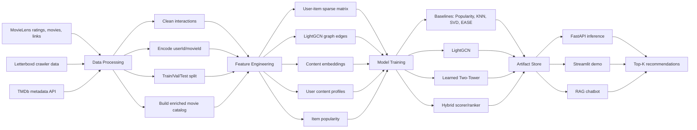

# CHƯƠNG 4. PHƯƠNG PHÁP ĐỀ XUẤT

Chương này trình bày phương pháp xây dựng hệ thống gợi ý phim hybrid trong đồ án. Hệ thống nhận dữ liệu tương tác người dùng-phim, metadata phim và ngữ cảnh phiên xem, sau đó huấn luyện nhiều mô hình gợi ý để tạo danh sách Top-K phim phù hợp cho từng người dùng.

Mục tiêu của phương pháp đề xuất là kết hợp hai nhóm tín hiệu chính:

- Tín hiệu collaborative filtering từ lịch sử tương tác người dùng-phim.
- Tín hiệu content-based từ metadata phim như thể loại, mô tả, đạo diễn, diễn viên, keyword và độ phổ biến.

Ký hiệu sử dụng trong chương:

- `U`: tập người dùng.
- `I`: tập phim.
- `R`: ma trận tương tác user-item.
- `u`: một người dùng.
- `i`: một phim.
- `K`: số lượng phim cần gợi ý, trong thực nghiệm dùng `K = 10`.
- `rating >= 4.0`: tương tác tích cực.

## 4.1. Kiến trúc tổng thể hệ thống

Hệ thống được thiết kế theo kiến trúc pipeline gồm 5 lớp: thu thập dữ liệu, xử lý dữ liệu, huấn luyện mô hình, lưu artifact và phục vụ gợi ý qua API/UI.

**Hình 4.1. Kiến trúc tổng thể hệ thống**



Ở mức hệ thống, input và output được xác định như sau:

| Thành phần | Input | Output |
|---|---|---|
| Data processing | `ratings.csv`, `movies.csv`, `links.csv`, Letterboxd raw CSV, TMDb metadata | Interaction đã làm sạch, catalog phim enriched |
| Feature engineering | Interaction sạch, catalog enriched | Ma trận user-item, graph edges, content embedding, user profile, popularity vector |
| Model training | Train/validation split và feature | Embedding, trọng số mô hình, trọng số hybrid, metric |
| Artifact store | Output của training | `*.npy`, `*.json`, `movie_catalog.parquet` |
| Recommendation | `user_id`, `session_context`, `top_k`, `model_name` | Danh sách Top-K phim gồm `movie_id`, `title`, `score`, poster, genre, overview, explanation |

## 4.2. Pipeline xử lý dữ liệu và biểu diễn dữ liệu

Pipeline tổng quát của hệ thống:

```text
Data Collection
-> Data Cleaning
-> Feature Engineering
-> Model Training
-> Artifact Export
-> Recommendation
```

### 4.2.1. Data Collection

Hệ thống sử dụng ba nguồn dữ liệu:

| Nguồn dữ liệu | Nội dung | Vai trò |
|---|---|---|
| MovieLens | `ratings.csv`, `movies.csv`, `links.csv` | Dữ liệu benchmark chuẩn cho recommender system |
| Letterboxd | `interactions.csv`, `movies.csv`, `users.csv` sau crawl | Dữ liệu thực tế hơn, có nhiều user và tương tác hơn |
| TMDb | Overview, poster, genre mở rộng, keyword, director, cast, vote, popularity | Làm giàu thông tin nội dung phim |

Input của bước này là dữ liệu thô. Output là các bảng dữ liệu ban đầu có schema thống nhất:

```text
ratings(userId, movieId, rating, timestamp)
movies(movieId, title, genres)
catalog(movieId, title, genres, tmdb_id, overview, keywords, director, cast, ...)
```

### 4.2.2. Data Cleaning

Các thao tác làm sạch chính:

- Ép kiểu `userId`, `movieId`, `rating`, `timestamp`.
- Loại bỏ tương tác không hợp lệ.
- Chỉ giữ tương tác tích cực với `rating >= 4.0`.
- Với Letterboxd, chuyển dữ liệu crawler sang format tương thích MovieLens.
- Với Letterboxd, dùng synthetic random timestamp theo từng user vì `created_at` là thời điểm crawl, không phải thời điểm xem phim thật.
- Mapping `userId` và `movieId` gốc sang chỉ số liên tục `user_idx`, `item_idx`.

Output của bước này:

```text
interactions(userId, movieId, rating, timestamp, user_idx, item_idx)
user_mapping: userId -> user_idx
item_mapping: movieId -> item_idx
```

### 4.2.3. Train/Validation/Test Split

Sau khi lọc positive interaction, dữ liệu được chia theo từng user:

- MovieLens: split theo timestamp thật của từng user.
- Letterboxd: split random ổn định theo từng user bằng synthetic timestamp.
- Tỷ lệ mặc định: train khoảng 80%, validation khoảng 10%, test khoảng 10%.
- User có quá ít tương tác được ưu tiên giữ nhiều interaction trong train để không làm mất lịch sử học.

Input:

```text
interactions(user_idx, item_idx, rating, timestamp)
```

Output:

```text
train interactions
validation interactions
test interactions
train_user_items: user_idx -> set(item_idx)
val_user_items: user_idx -> set(item_idx)
test_user_items: user_idx -> set(item_idx)
```

### 4.2.4. Biểu diễn interaction matrix

Từ tập train, hệ thống xây dựng ma trận user-item sparse:

```text
R in R^(num_users x num_items)
R[u, i] = 1 nếu user u có positive interaction với phim i
R[u, i] = 0 nếu chưa quan sát được tương tác tích cực
```

Ma trận này được lưu ở dạng CSR sparse matrix để tiết kiệm bộ nhớ vì dữ liệu recommender rất thưa.

Input:

```text
train(user_idx, item_idx)
```

Output:

```text
train_matrix: sparse CSR matrix, shape = (num_users, num_items)
```

### 4.2.5. Feature Engineering cho model

Các feature chính được tạo cho mô hình:

| Feature | Cách tạo | Model sử dụng |
|---|---|---|
| `train_matrix` | Sparse matrix từ positive interactions | Popularity, KNN, SVD, EASE, evaluation |
| Graph edges | Mỗi positive interaction là một cạnh user-item | LightGCN |
| Content text | Nối `title`, `genres`, `overview`, `keywords`, `director`, `cast`, ... | TF-IDF/SBERT |
| Content embedding | TF-IDF + TruncatedSVD hoặc SBERT | Content-based, Two-Tower, Hybrid |
| User profile | Trung bình embedding các phim user đã thích | Content-based |
| Popularity vector | `log1p(count positive)` chuẩn hóa | Popularity baseline, Hybrid fallback |

Trong artifact hiện tại, content embedding có kích thước:

| Dataset | `content_embeddings` | `user_profiles` | LightGCN embedding | Two-Tower embedding |
|---|---:|---:|---:|---:|
| MovieLens | 6,298 x 256 | 609 x 256 | 64 chiều | 64 chiều |
| Letterboxd | 7,211 x 256 | 8,985 x 256 | 64 chiều | 64 chiều |

### 4.2.6. Model Training và Artifact

Sau khi có feature, hệ thống huấn luyện từng mô hình và lưu artifact để inference không cần train lại.

Artifact chính gồm:

| File | Ý nghĩa |
|---|---|
| `movie_catalog.parquet` | Catalog phim đã enrich metadata |
| `user_mapping.json` | Mapping từ user ID gốc sang user index |
| `item_mapping.json` | Mapping từ movie ID gốc sang item index |
| `content_embeddings.npy` | Embedding nội dung của từng phim |
| `user_profiles.npy` | Profile nội dung của từng user |
| `item_popularity.npy` | Điểm popularity của từng phim |
| `lightgcn_user_embeddings.npy` | Embedding user từ LightGCN |
| `lightgcn_item_embeddings.npy` | Embedding item từ LightGCN |
| `two_tower_user_embeddings.npy` | Embedding user từ Learned Two-Tower |
| `two_tower_item_embeddings.npy` | Embedding item từ Learned Two-Tower |
| `hybrid_config.json` | Trọng số hybrid, `min_rating`, `k`, backend nội dung |
| `metrics.json` | Metric validation/test và training loss |

### 4.2.7. Recommendation

Ở pha inference, hệ thống nhận request:

```text
user_id: ID người dùng, có thể rỗng với cold-start
session_context: danh sách phim người dùng chọn trong phiên hiện tại
top_k: số phim cần gợi ý
model_name: hybrid, lightgcn, two_tower, content, popularity
```

Quy trình inference:

1. Load artifact từ disk.
2. Tính điểm collaborative từ LightGCN nếu có `user_id`.
3. Tính điểm Two-Tower nếu có `user_id`.
4. Tính điểm content từ user profile hoặc session profile.
5. Tính điểm popularity.
6. Chuẩn hóa Min-Max từng nguồn điểm.
7. Kết hợp điểm theo trọng số hybrid.
8. Mask các phim user đã xem trong train và phim nằm trong session context.
9. Lấy Top-K phim có điểm cao nhất.

Output trả về:

```text
recommendations = [
  {
    movie_id,
    tmdb_id,
    title,
    score,
    poster_url,
    genres,
    overview,
    director,
    cast,
    explanation_tags
  },
  ...
]
```

## 4.3. Popularity Baseline

Popularity là baseline đơn giản, dùng số lượng tương tác tích cực trong train để xếp hạng phim.

Công thức:

```text
pop(i) = log(1 + count_train(i))
score(u, i) = pop(i) / max_j pop(j)
```

| Thành phần | Mô tả |
|---|---|
| Input train | `train_matrix`, số lần mỗi phim xuất hiện trong positive interactions |
| Input inference | `user_id` không bắt buộc |
| Output train | `item_popularity.npy` |
| Output inference | Điểm popularity cho mọi phim |

Ưu điểm của mô hình là nhanh, ổn định và phù hợp làm fallback cho user mới. Hạn chế là không cá nhân hóa, dễ thiên lệch về phim nổi tiếng và gần như không gợi ý được phim long-tail.

## 4.4. UserKNN và ItemKNN Cosine

KNN khai thác độ tương tự cosine trên ma trận user-item.

Với ItemKNN, tính độ giống nhau giữa hai phim dựa trên tập user cùng tương tác:

```text
sim(i, j) = cosine(R[:, i], R[:, j])
score(u, i) = sum_j R[u, j] * sim(j, i)
```

Với UserKNN, tính độ giống nhau giữa hai user:

```text
sim(u, v) = cosine(R[u, :], R[v, :])
score(u, i) = sum_v sim(u, v) * R[v, i]
```

| Thuật toán | Input train | Output train | Input inference | Output inference |
|---|---|---|---|---|
| ItemKNN | `train_matrix` | Ma trận item-item similarity Top-100 | `user_idx` | Điểm cho toàn bộ phim |
| UserKNN | `train_matrix` | Ma trận user-user similarity Top-100 | `user_idx` | Điểm cho toàn bộ phim |

KNN phù hợp khi dữ liệu có đủ overlap giữa user hoặc item. Trên dữ liệu rất thưa, KNN dễ thiên về các phim phổ biến.

## 4.5. SVD Ranking

SVD Ranking là baseline matrix factorization tuyến tính. Mô hình phân rã ma trận tương tác thành latent factor của user và item:

```text
R ~= P Q^T
score(u, i) = P[u] dot Q[i]
```

Trong dự án, SVD Ranking dùng `TruncatedSVD` với số chiều mặc định 64.

| Thành phần | Mô tả |
|---|---|
| Input train | Sparse user-item matrix từ positive interactions |
| Output train | `user_factors`, `item_factors` |
| Input inference | `user_idx` |
| Output inference | Vector điểm `score(u, :)` cho toàn bộ phim |

SVD có ưu điểm đơn giản, train nhanh trên tập vừa và thường là baseline mạnh. Tuy nhiên, mô hình chỉ khai thác interaction, không sử dụng metadata nên kém hiệu quả với cold-start item.

## 4.6. BPR Matrix Factorization

BPR-MF học embedding user và item bằng mục tiêu ranking. Với mỗi user, mô hình lấy một positive item `i+` và một negative item `i-`, sau đó tối ưu để:

```text
score(u, i+) > score(u, i-)
```

Công thức điểm:

```text
score(u, i) = p_u dot q_i
```

Loss BPR:

```text
L = -log sigmoid(score(u, i+) - score(u, i-)) + lambda * ||theta||^2
```

| Thành phần | Mô tả |
|---|---|
| Input train | `train_user_items`, `num_items` |
| Sample train | Triplet `(user_idx, positive_item_idx, negative_item_idx)` |
| Output train | User embedding và item embedding |
| Input inference | `user_idx` |
| Output inference | Điểm dot product cho toàn bộ phim |

BPR-MF phù hợp với implicit feedback vì mục tiêu trực tiếp là xếp hạng, không phải dự đoán rating tuyệt đối.

## 4.7. EASE

EASE là mô hình tuyến tính item-item cho implicit feedback. Mô hình học ma trận trọng số `W` sao cho lịch sử tương tác của user có thể tái tạo lại các item user có khả năng thích.

Công thức:

```text
G = X^T X
P = inverse(G + lambda I)
W = -P / diag(P)
diag(W) = 0
score(u, :) = X[u, :] W
```

| Thành phần | Mô tả |
|---|---|
| Input train | Ma trận user-item `X` |
| Hyperparameter | `lambda = 250.0` |
| Output train | Ma trận trọng số item-item `W` |
| Input inference | Lịch sử item của user |
| Output inference | Điểm cho toàn bộ item |

EASE là baseline rất mạnh trên dữ liệu implicit vừa và nhỏ. Hạn chế chính là phải nghịch đảo ma trận item-item, nên chi phí tăng nhanh khi số item lớn.

## 4.8. Content-Based Model

Content-based model sử dụng metadata phim để biểu diễn mỗi phim thành vector nội dung.

Văn bản đầu vào của mỗi phim được tạo bằng cách nối:

```text
title + genres + overview + tmdb_genres + keywords + director + cast + writers + ...
```

Trong thực nghiệm hiện tại, backend dùng TF-IDF + TruncatedSVD để tạo embedding 256 chiều. Hệ thống cũng hỗ trợ SBERT `sentence-transformers/all-mpnet-base-v2`.

User profile được tính bằng trung bình embedding của các phim user đã thích:

```text
profile(u) = mean(embedding(i) for i in history(u))
score_content(u, i) = cosine(profile(u), embedding(i))
```

Với user mới, có thể thay `history(u)` bằng `session_context`, tức các phim người dùng chọn trong phiên hiện tại.

| Thành phần | Mô tả |
|---|---|
| Input train | Catalog phim enriched metadata |
| Output train | `content_embeddings.npy`, `user_profiles.npy` |
| Input inference | `user_id` hoặc `session_context` |
| Output inference | Điểm cosine similarity giữa profile và từng phim |

Content-based model đặc biệt hữu ích cho cold-start, session-based recommendation và phim long-tail. Hạn chế là nếu chỉ dùng metadata thì mức cá nhân hóa thường thấp hơn collaborative filtering.

## 4.9. LightGCN

LightGCN là mô hình collaborative filtering trên đồ thị hai phía user-item. Mỗi user và mỗi phim là một node; mỗi positive interaction là một cạnh.

Input graph:

```text
edges = {(u, i) | user u có positive interaction với phim i}
```

Ma trận kề chuẩn hóa:

```text
A_norm = D^(-1/2) A D^(-1/2)
```

Lan truyền embedding qua `K` layer:

```text
E^(k+1) = A_norm E^(k)
E_final = mean(E^(0), E^(1), ..., E^(K))
score(u, i) = e_u dot e_i
```

Loss huấn luyện dùng BPR:

```text
L = -log sigmoid(score(u, i+) - score(u, i-))
```

| Thành phần | Mô tả |
|---|---|
| Input train | Graph edges từ `train(user_idx, item_idx)` |
| Hyperparameter | Embedding dim 64, 3 graph layers, 50 epochs trong artifact chính |
| Output train | `lightgcn_user_embeddings.npy`, `lightgcn_item_embeddings.npy` |
| Input inference | `user_idx` |
| Output inference | Điểm collaborative cho mọi phim |

LightGCN phù hợp với dữ liệu sparse vì thông tin được lan truyền qua đồ thị user-item. Mô hình không cần feature transformation phức tạp như GCN truyền thống, nên nhẹ hơn và phù hợp với recommender implicit feedback.

## 4.10. Learned Two-Tower

Learned Two-Tower học không gian chung giữa user và item. Mô hình gồm:

- User tower: embedding học được cho từng user.
- Item tower: MLP biến content embedding của phim thành item embedding.

Công thức:

```text
z_u = normalize(UserEmbedding[u])
z_i = normalize(MLP(content_embedding[i]))
score(u, i) = z_u dot z_i
```

Mô hình cũng được train bằng BPR triplet:

```text
(user_idx, positive_item_idx, negative_item_idx)
```

| Thành phần | Mô tả |
|---|---|
| Input train | `train_user_items`, `content_embeddings` |
| Hyperparameter | Embedding dim 64, hidden dim 128, 50 epochs |
| Output train | `two_tower_user_embeddings.npy`, `two_tower_item_embeddings.npy` |
| Input inference | `user_idx` |
| Output inference | Điểm dot product giữa user embedding và item embedding |

Two-Tower giúp đưa tín hiệu metadata vào mô hình học ranking. So với content average thuần, Two-Tower có khả năng học lại không gian embedding theo hành vi người dùng.

## 4.11. Hybrid Weighted Scorer

Hybrid Weighted Scorer là mô hình triển khai chính trong artifact `pdf_clean`. Mô hình kết hợp bốn nguồn điểm:

- `score_cf`: điểm LightGCN.
- `score_two_tower`: điểm Learned Two-Tower.
- `score_content`: điểm content similarity.
- `score_popularity`: điểm popularity.

Trước khi cộng, từng nguồn điểm được chuẩn hóa Min-Max theo từng user:

```text
s_norm = (s - min(s)) / (max(s) - min(s) + epsilon)
```

Điểm cuối:

```text
score_hybrid(u, i) =
    w_cf * score_cf_norm(u, i)
  + w_two_tower * score_two_tower_norm(u, i)
  + w_content * score_content_norm(u, i)
  + w_popularity * score_popularity_norm(i)
```

Trọng số được chọn bằng grid search trên validation set, tối ưu `NDCG@10`.

| Dataset | `w_cf` | `w_two_tower` | `w_content` | `w_popularity` |
|---|---:|---:|---:|---:|
| MovieLens artifact | 0.1 | 0.8 | 0.1 | 0.0 |
| Letterboxd artifact | 0.3 | 0.3 | 0.3 | 0.1 |

| Thành phần | Mô tả |
|---|---|
| Input train | Điểm validation của LightGCN, Two-Tower, Content, Popularity |
| Output train | Trọng số hybrid trong `hybrid_config.json` |
| Input inference | `user_id`, `session_context`, embedding và popularity |
| Output inference | Điểm hybrid cho toàn bộ phim và danh sách Top-K |

Hybrid Weighted Scorer cân bằng giữa cá nhân hóa collaborative và nội dung phim. Đây là mô hình phù hợp để demo vì dễ giải thích, không dùng score của các baseline mạnh như EASE làm feature.

## 4.12. Hybrid Ranker

Hybrid Ranker là mô hình học cách kết hợp các component scorer thay vì dùng trọng số cố định. Trong comparison hiện tại, ranker dùng `SGDClassifier(loss="log_loss")` trên feature của từng cặp `(user, item)`.

Feature đầu vào:

```text
score_lightgcn(u, i)
score_two_tower(u, i)
score_content(u, i)
score_popularity(i)
history_length(u)
```

Label:

```text
1 nếu (u, i) là positive interaction trong train
0 nếu i là negative sample của user u
```

Output:

```text
P(user u thích item i)
```

| Thành phần | Mô tả |
|---|---|
| Input train | Component scores, popularity, độ dài lịch sử user, positive/negative samples |
| Output train | Classifier/ranker học trọng số phi tuyến nhẹ |
| Input inference | `user_idx`, toàn bộ candidate item |
| Output inference | Xác suất hoặc điểm ranking cho từng phim |

Hybrid Ranker thường tốt hơn weighted hybrid khi có đủ dữ liệu để học cách phối hợp các nguồn điểm. Tuy nhiên, mô hình khó giải thích hơn và phụ thuộc vào chất lượng negative sampling.

# CHƯƠNG 5. THỰC NGHIỆM VÀ ĐÁNH GIÁ

Chương này trình bày thiết lập thực nghiệm và kết quả đánh giá trên hai tập dữ liệu: MovieLens và Letterboxd. Mục tiêu là so sánh mô hình đề xuất với các baseline, đồng thời phân tích mô hình nào phù hợp với từng bối cảnh sử dụng.

Các thí nghiệm sử dụng ranking metrics Top-10. Khi đánh giá, các item đã xuất hiện trong train của user được mask khỏi danh sách gợi ý để tránh việc mô hình được điểm nhờ gợi ý lại phim user đã xem.

## 5.1. Môi trường thực nghiệm

| Nhóm | Công cụ |
|---|---|
| Ngôn ngữ | Python 3.10+ |
| Xử lý dữ liệu | Pandas, NumPy |
| Ma trận sparse | SciPy |
| Machine Learning | scikit-learn |
| Deep Learning | PyTorch |
| Recommender baseline | Surprise/SVD baseline hoặc TruncatedSVD nội bộ |
| Text embedding | TF-IDF, TruncatedSVD, Sentence-Transformers/SBERT |
| Backend demo | FastAPI, Uvicorn |
| Frontend demo | Streamlit |
| Lưu trữ artifact | Parquet, JSON, NPY |
| Đánh giá và kiểm thử | pytest |

Trong artifact hiện tại, content backend dùng `tfidf` để bảo đảm có thể chạy ổn định trên CPU. Hệ thống vẫn hỗ trợ SBERT nếu môi trường có đủ tài nguyên.

## 5.2. Cấu hình dữ liệu và protocol

### 5.2.1. MovieLens

MovieLens sử dụng dữ liệu `ml-latest-small`. Sau khi lọc `rating >= 4.0`, hệ thống chỉ giữ lại positive interactions để huấn luyện mô hình ranking implicit feedback.

| Thuộc tính | Giá trị |
|---|---:|
| Số interactions gốc | 100,836 |
| Số users gốc | 610 |
| Số movies gốc | 9,724 |
| Positive interactions (`rating >= 4.0`) | 48,580 |
| Positive users | 609 |
| Positive items | 6,298 |
| Train interactions | 38,833 |
| Validation interactions | 4,872 |
| Test interactions | 4,875 |
| Split strategy | Timestamp per user |
| Sparse users | 165 |
| Warm users | 444 |
| Long-tail items | 2,950 |
| Head items | 1,443 |

### 5.2.2. Letterboxd

Letterboxd là dữ liệu crawler riêng và được chuyển sang schema tương thích MovieLens. Vì timestamp gốc của Letterboxd trong dữ liệu là thời điểm crawl, hệ thống dùng synthetic random timestamp ổn định theo từng user để chia train/validation/test.

| Thuộc tính | Giá trị |
|---|---:|
| Số interactions gốc | 503,761 |
| Số users gốc | 9,197 |
| Số movies gốc | 7,848 |
| Positive interactions (`rating >= 4.0`) | 202,354 |
| Positive users | 8,985 |
| Positive items | 7,211 |
| Train interactions | 160,843 |
| Validation interactions | 20,669 |
| Test interactions | 20,842 |
| Split strategy | Random per user với synthetic timestamp |
| Sparse users | 2,342 |
| Warm users | 6,643 |
| Long-tail items | 3,564 |
| Head items | 1,827 |

## 5.3. Thiết lập thực nghiệm

### 5.3.1. Train/Test Split

Với mỗi user, các positive interactions được chia thành train, validation và test. Tập train dùng để học mô hình, validation dùng để chọn trọng số hybrid, test dùng để báo cáo kết quả cuối.

Quy tắc đánh giá:

- Chỉ đánh giá trên user có ít nhất một item trong test.
- Khi sinh Top-K, mask toàn bộ phim user đã xem trong train.
- Ground truth là tập item positive trong test.
- `K = 10`.
- Seed cố định: `42`.

### 5.3.2. Tham số mô hình

| Mô hình | Tham số chính |
|---|---|
| Popularity | `log1p(count positive)`, chuẩn hóa Min-Max |
| ItemKNN/UserKNN | Cosine similarity, Top-100 neighbors |
| SVD Ranking | `n_components = 64` |
| EASE | `l2 = 250.0` |
| BPR-MF | Embedding dim 64, BPR loss |
| LightGCN | Embedding dim 64, 3 layers, BPR loss |
| Content-based | TF-IDF `max_features = 5000`, ngram `(1,2)`, TruncatedSVD 256 chiều |
| Learned Two-Tower | Embedding dim 64, hidden dim 128, BPR loss |
| Hybrid Weighted | Grid search trọng số theo `NDCG@10` trên validation |
| Hybrid Ranker | Logistic ranker với negative sampling |

Artifact chính dùng 50 epochs cho LightGCN và Learned Two-Tower trên cả MovieLens và Letterboxd.

### 5.3.3. Metric đánh giá

Các metric được dùng:

| Metric | Ý nghĩa |
|---|---|
| Precision@10 | Tỷ lệ phim đúng trong 10 phim được gợi ý |
| Recall@10 | Tỷ lệ phim đúng trong test được tìm thấy trong Top-10 |
| NDCG@10 | Đánh giá cả việc gợi ý đúng và thứ tự xếp hạng |
| MRR | Thứ hạng nghịch đảo trung bình của hit đầu tiên |
| Sparse NDCG@10 | NDCG@10 riêng cho nhóm user ít lịch sử |
| Tail NDCG@10 | NDCG@10 riêng cho nhóm phim long-tail |

Trong recommender system, `NDCG@10` được xem là metric chính vì nó phản ánh chất lượng thứ tự của danh sách gợi ý.

## 5.4. Kết quả đánh giá

### 5.4.1. Kết quả artifact chính

Kết quả artifact chính `hybrid_pdf_clean` trên MovieLens:

| Split | Precision@10 | Recall@10 | NDCG@10 | MRR |
|---|---:|---:|---:|---:|
| Validation | 0.0350 | 0.0826 | 0.0641 | 0.1030 |
| Test | 0.0224 | 0.0564 | 0.0446 | 0.0736 |

Kết quả artifact chính `hybrid_pdf_clean` trên Letterboxd:

| Split | Precision@10 | Recall@10 | NDCG@10 | MRR |
|---|---:|---:|---:|---:|
| Validation | 0.0363 | 0.1585 | 0.1095 | 0.1361 |
| Test | 0.0355 | 0.1562 | 0.1074 | 0.1314 |

Nhận xét ban đầu:

- Letterboxd đạt NDCG@10 cao hơn MovieLens vì có nhiều interaction hơn.
- Trọng số hybrid của MovieLens nghiêng mạnh về Two-Tower (`0.8`), cho thấy metadata giúp bổ sung cho tập nhỏ.
- Trọng số hybrid của Letterboxd cân bằng hơn giữa LightGCN, Two-Tower và content (`0.3/0.3/0.3`) và vẫn giữ `0.1` popularity.

### 5.4.2. Kết quả comparison trên MovieLens

| Model | Precision@10 | Recall@10 | NDCG@10 | MRR | Sparse NDCG@10 | Tail NDCG@10 |
|---|---:|---:|---:|---:|---:|---:|
| EASE | 0.0299 | 0.0612 | 0.0506 | 0.0898 | 0.0430 | 0.0000 |
| SVD Ranking | 0.0250 | 0.0604 | 0.0454 | 0.0727 | 0.0454 | 0.0000 |
| ItemKNN Cosine | 0.0275 | 0.0554 | 0.0438 | 0.0736 | 0.0394 | 0.0007 |
| Hybrid Ranker Full | 0.0248 | 0.0515 | 0.0437 | 0.0743 | 0.0507 | 0.0000 |
| UserKNN Cosine | 0.0255 | 0.0554 | 0.0435 | 0.0736 | 0.0437 | 0.0000 |
| Hybrid Weighted Full | 0.0232 | 0.0565 | 0.0429 | 0.0727 | 0.0489 | 0.0000 |
| Hybrid No TMDb | 0.0232 | 0.0542 | 0.0406 | 0.0664 | 0.0479 | 0.0000 |
| LightGCN Only | 0.0220 | 0.0458 | 0.0394 | 0.0687 | 0.0465 | 0.0000 |
| BPR-MF | 0.0242 | 0.0476 | 0.0388 | 0.0696 | 0.0364 | 0.0000 |
| Popularity Only | 0.0194 | 0.0397 | 0.0365 | 0.0677 | 0.0409 | 0.0000 |
| Learned Two-Tower | 0.0137 | 0.0324 | 0.0272 | 0.0478 | 0.0274 | 0.0000 |
| TF-IDF Only | 0.0063 | 0.0171 | 0.0113 | 0.0184 | 0.0153 | 0.0074 |
| Random | 0.0013 | 0.0018 | 0.0030 | 0.0084 | 0.0000 | 0.0000 |

### 5.4.3. Kết quả comparison trên Letterboxd

| Model | Precision@10 | Recall@10 | NDCG@10 | MRR | Sparse NDCG@10 | Tail NDCG@10 |
|---|---:|---:|---:|---:|---:|---:|
| EASE | 0.0480 | 0.1940 | 0.1376 | 0.1742 | 0.0880 | 0.0000 |
| Hybrid Ranker Full | 0.0402 | 0.1732 | 0.1219 | 0.1517 | 0.1207 | 0.0098 |
| Hybrid Weighted Full | 0.0401 | 0.1711 | 0.1190 | 0.1487 | 0.1053 | 0.0046 |
| UserKNN Cosine | 0.0409 | 0.1671 | 0.1155 | 0.1469 | 0.0726 | 0.0000 |
| ItemKNN Cosine | 0.0402 | 0.1625 | 0.1148 | 0.1483 | 0.0672 | 0.0069 |
| LightGCN Only | 0.0356 | 0.1441 | 0.0959 | 0.1211 | 0.0538 | 0.0009 |
| Hybrid No TMDb | 0.0356 | 0.1441 | 0.0959 | 0.1211 | 0.0538 | 0.0009 |
| SVD Ranking | 0.0293 | 0.1139 | 0.0809 | 0.1091 | 0.0493 | 0.0000 |
| BPR-MF | 0.0287 | 0.1122 | 0.0767 | 0.0999 | 0.0417 | 0.0004 |
| Popularity Only | 0.0199 | 0.0831 | 0.0525 | 0.0636 | 0.0317 | 0.0000 |
| TF-IDF Only | 0.0074 | 0.0526 | 0.0339 | 0.0318 | 0.0997 | 0.0323 |
| Learned Two-Tower | 0.0125 | 0.0498 | 0.0299 | 0.0372 | 0.0165 | 0.0000 |
| Random | 0.0006 | 0.0022 | 0.0010 | 0.0010 | 0.0000 | 0.0009 |

## 5.5. Phân tích kết quả

### 5.5.1. Mô hình nào tốt nhất?

Nếu xét toàn bộ test set theo `NDCG@10`, EASE là mô hình tốt nhất trên cả hai dataset:

| Dataset | Mô hình tốt nhất overall | NDCG@10 |
|---|---|---:|
| MovieLens | EASE | 0.0506 |
| Letterboxd | EASE | 0.1376 |

Tuy nhiên, nếu xét nhóm mô hình đề xuất hybrid, Hybrid Ranker Full là mô hình tốt nhất:

| Dataset | Hybrid tốt nhất | NDCG@10 | Sparse NDCG@10 |
|---|---|---:|---:|
| MovieLens | Hybrid Ranker Full | 0.0437 | 0.0507 |
| Letterboxd | Hybrid Ranker Full | 0.1219 | 0.1207 |

Điểm đáng chú ý là Hybrid Ranker Full không đứng đầu overall trên MovieLens nhưng lại đứng đầu ở nhóm sparse user. Trên Letterboxd, Hybrid Ranker Full đứng thứ hai overall sau EASE và vượt EASE rõ rệt ở nhóm sparse user.

### 5.5.2. Nguyên nhân

EASE đạt kết quả overall cao vì:

- Dataset có nhiều tín hiệu đồng xuất hiện item-item.
- EASE học trực tiếp quan hệ item-item toàn cục.
- Các phim head item xuất hiện nhiều trong test, nên mô hình item-item mạnh có lợi thế.

Hybrid Ranker và Hybrid Weighted tốt với sparse user vì:

- Không chỉ dựa vào collaborative signal.
- Có thêm content embedding từ metadata phim.
- Có popularity fallback khi lịch sử user ít.
- Có thể tận dụng session context trong inference.

Content-only có NDCG overall thấp vì:

- Metadata chỉ mô tả nội dung phim, không phản ánh đầy đủ khác biệt khẩu vị giữa các user.
- Nhiều user có thể thích cùng genre nhưng khác phong cách phim.
- TF-IDF khó biểu diễn ngữ nghĩa sâu bằng SBERT.

Tuy nhiên, content-only có Tail NDCG@10 tốt nhất trên Letterboxd (`0.0323`), cho thấy content feature rất quan trọng khi cần gợi ý phim ít tương tác.

LightGCN không vượt EASE trong kết quả hiện tại vì:

- Embedding dim và epoch còn tương đối nhỏ so với kích thước dữ liệu.
- Dữ liệu MovieLens nhỏ, graph signal không đủ mạnh để vượt baseline tuyến tính.
- Backend content hiện dùng TF-IDF CPU, chưa phải SBERT đầy đủ.

### 5.5.3. Mô hình phù hợp trong từng trường hợp

| Trường hợp | Mô hình phù hợp | Lý do |
|---|---|---|
| User warm, có nhiều lịch sử | EASE, KNN, SVD, LightGCN | Collaborative signal đủ mạnh |
| User ít lịch sử | Hybrid Ranker, Hybrid Weighted, Content-based | Kết hợp content và popularity giúp giảm cold-start |
| User mới chỉ chọn vài phim trong session | Content-based hoặc Hybrid với session context | Có thể tạo session profile từ phim đã chọn |
| Phim long-tail ít interaction | Content-based, Hybrid | Metadata giúp phim ít rating vẫn có cơ hội được gợi ý |
| Cần inference nhanh và đơn giản | Popularity, SVD, Weighted Hybrid artifact | Dễ deploy, tính điểm nhanh |
| Cần chất lượng overall trên tập benchmark | EASE | Baseline item-item mạnh trong dữ liệu implicit |
| Cần cân bằng chất lượng và khả năng giải thích | Hybrid Weighted | Có thể giải thích bằng CF, content, director, genre, popularity |

### 5.5.4. Kết luận rút ra

Từ kết quả thực nghiệm, có thể rút ra các kết luận sau:

1. Không có một mô hình duy nhất tốt nhất cho mọi bối cảnh. EASE tốt nhất overall, nhưng hybrid tốt hơn cho sparse user và có khả năng xử lý cold-start/session tốt hơn.
2. Metadata TMDb có đóng góp thực tế. Trên MovieLens, Hybrid No TMDb thấp hơn Hybrid Weighted Full; trên Letterboxd, bỏ TMDb làm kết quả tụt về mức gần LightGCN only.
3. Content-only không đủ để cá nhân hóa toàn bộ hệ thống, nhưng rất quan trọng cho long-tail và user ít dữ liệu.
4. Hybrid là hướng phù hợp cho hệ thống demo thực tế vì cân bằng giữa độ chính xác, khả năng giải thích và khả năng hoạt động khi dữ liệu user còn ít.
5. Letterboxd đạt metric cao hơn MovieLens do số lượng interaction lớn hơn, nhưng cũng có nhiều sparse user hơn, nên hybrid có giá trị thực tiễn rõ hơn.

## 5.6. Một số ví dụ gợi ý định tính

Các ví dụ dưới đây được lấy từ artifact inference hiện tại, sau khi mask các phim user đã xem trong train.

| User | Dataset | Lịch sử tiêu biểu | Gợi ý Top phim | Nhận xét |
|---|---|---|---|---|
| User A `userId=508` | MovieLens | `Back to the Future`, `Back to the Future Part II` | `Back to the Future Part III`, `The Matrix`, `Terminator 2: Judgment Day` | Mô hình nhận ra sở thích sci-fi/adventure và franchise continuation |
| User B `userId=253` | MovieLens | `Fargo`, `Amelie`, `Amadeus`, `Pan's Labyrinth`, `Election` | `Citizen Kane`, `Three Colors: Blue`, `A Streetcar Named Desire`, `The Apartment` | Mô hình nghiêng về phim classic/art-house/drama, phù hợp lịch sử có nhiều phim được đánh giá cao |
| User C `userId=1014` | Letterboxd | `Interstellar`, `Whiplash`, `Barbie`, `Superman`, `Avengers: Endgame` | `Spider-Man: No Way Home`, `Guardians of the Galaxy Vol. 3`, `Thor: Ragnarok`, `Avatar: The Way of Water` | Mô hình bắt được xu hướng blockbuster, sci-fi/action và phim phổ biến hiện đại |

Nhìn định tính, các gợi ý không chỉ là phim phổ biến chung mà còn có liên hệ với lịch sử user:

- User A có lịch sử rất ít nhưng gợi ý đầu tiên là phần tiếp theo của franchise.
- User B được gợi ý các phim kinh điển và drama có tính nghệ thuật cao.
- User C được gợi ý các phim đại chúng thuộc nhóm superhero/sci-fi, phù hợp với lịch sử Letterboxd có nhiều blockbuster.

Các ví dụ này minh họa vai trò của hybrid recommendation: collaborative signal giúp bắt xu hướng cộng đồng, còn content signal giúp giữ liên hệ về nội dung, đạo diễn, thể loại và phong cách phim.
